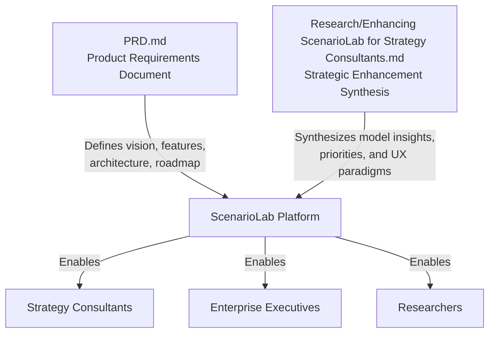
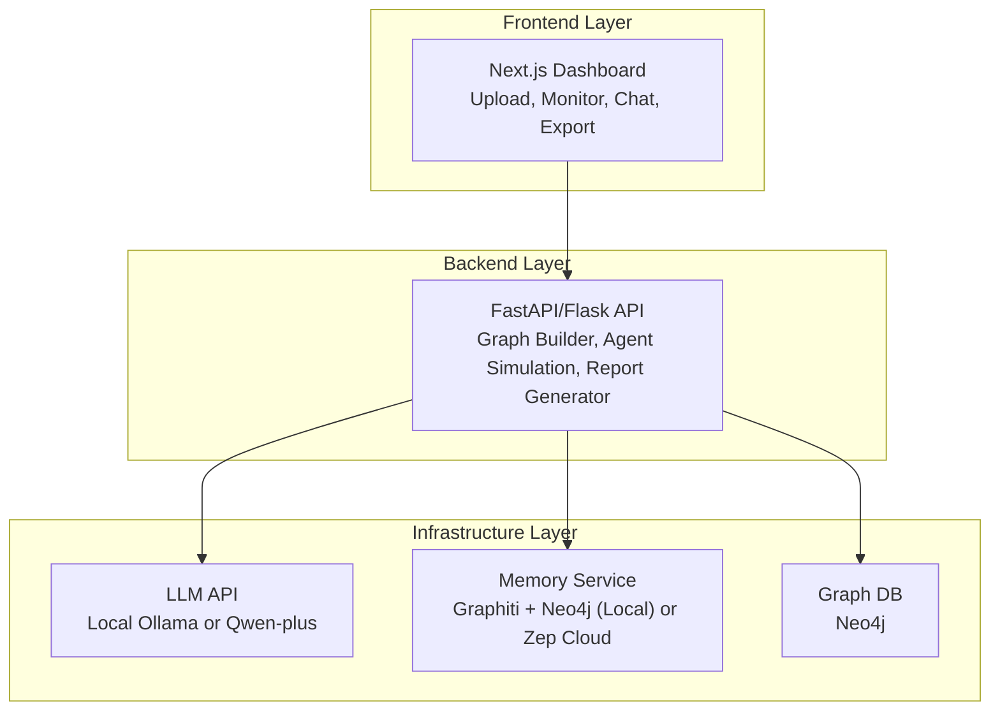
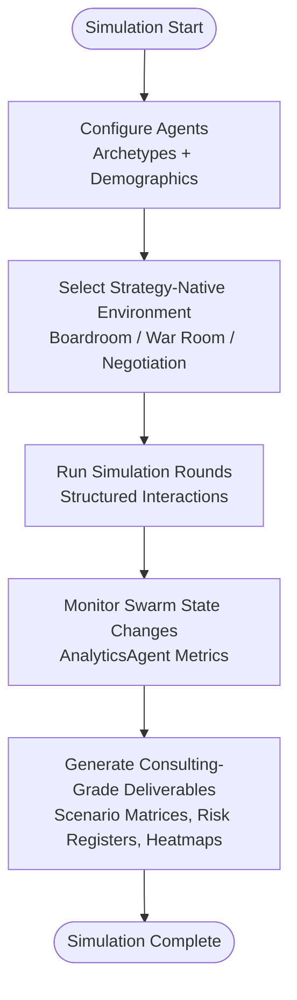
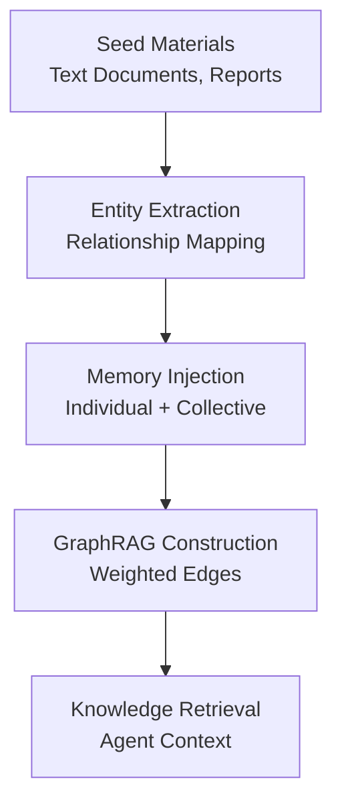
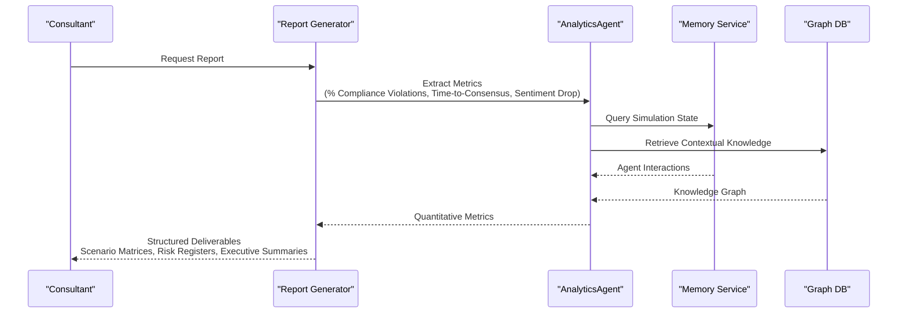
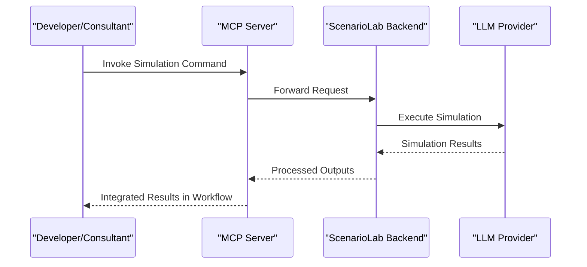
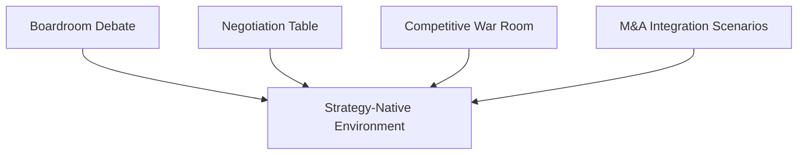
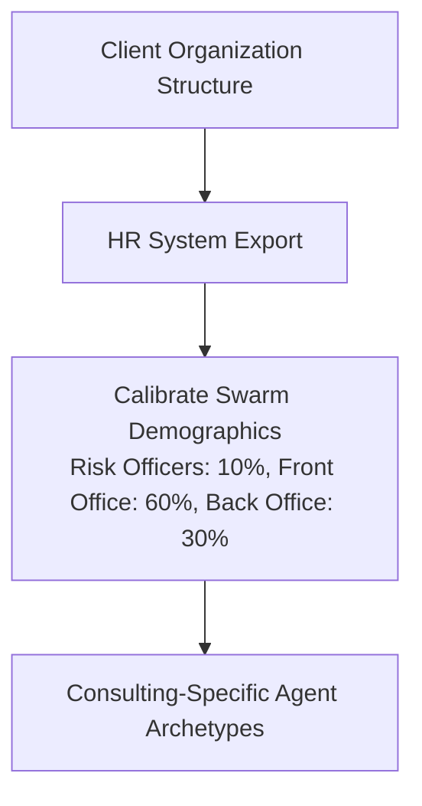
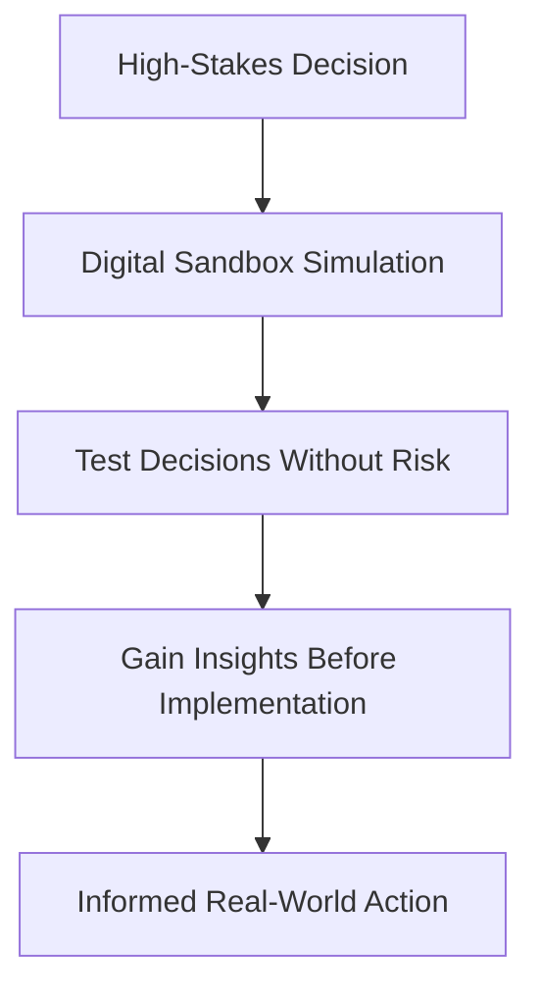
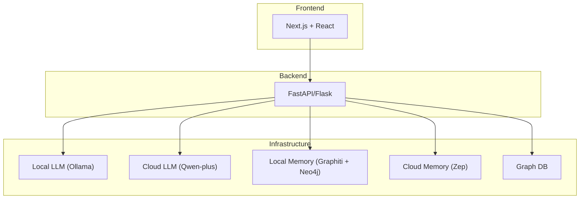

# Executive Summary

<cite>
**Referenced Files in This Document**
- [PRD.md](file://PRD.md)
- [Research/Enhancing ScenarioLab for Strategy Consultants.md](file://Research/Enhancing ScenarioLab for Strategy Consultants.md)
</cite>

## Table of Contents
1. [Introduction](#introduction)
2. [Project Structure](#project-structure)
3. [Core Components](#core-components)
4. [Architecture Overview](#architecture-overview)
5. [Detailed Component Analysis](#detailed-component-analysis)
6. [Dependency Analysis](#dependency-analysis)
7. [Performance Considerations](#performance-considerations)
8. [Troubleshooting Guide](#troubleshooting-guide)
9. [Conclusion](#conclusion)
10. [Appendices](#appendices)

## Introduction
ScenarioLab is an AI-powered strategic simulation and war-gaming platform designed for strategy consultants and enterprise decision-makers. Unlike traditional prediction engines, ScenarioLab functions as an AI decision lab for scenario rehearsal and strategic stress-testing. It constructs high-fidelity parallel digital worlds where intelligent agents—modeled after real-world stakeholders—interact in strategy-native environments (boardrooms, negotiations, war games) to help consultants test decisions before real-world implementation.

Key positioning:
- Tagline: AI-Powered War Gaming and Scenario Planning Platform for Strategic Decision-Making
- Core differentiator: Transform the traditional $50K–$200K war-gaming engagement into an on-demand, repeatable capability
- Essential tool for modern strategic advisory: zero-risk strategic rehearsal and consulting-grade deliverables

Value propositions:
- Transform traditional $50K–$200K war-gaming engagements into on-demand capabilities
- Stakeholder-accurate agent modeling calibrated to actual client organizational structures
- Strategy-native environments that move beyond social media simulations to boardroom debates, negotiation tables, and competitive war rooms
- Air-gapped local deployment for enterprise confidentiality
- MCP server integration for seamless developer and consultant workflows

Common use cases:
- M&A integration: culture clash simulation, integration planning, stakeholder resistance forecasting
- Regulatory response testing: compliance impact assessment, emergency response rehearsals
- Competitive strategy development: competitor reaction modeling, market entry simulations

## Project Structure
The repository contains two primary documents that define ScenarioLab’s strategic direction and technical foundation:
- PRD.md: Product Requirements Document outlining vision, features, architecture, and roadmap
- Research/Enhancing ScenarioLab for Strategy Consultants.md: Synthesis of three AI models’ recommendations for enhancing ScenarioLab for strategy consultants

**Diagram sources**
- [PRD.md](file://PRD.md)
- [Research/Enhancing ScenarioLab for Strategy Consultants.md](file://Research/Enhancing ScenarioLab for Strategy Consultants.md)

**Section sources**
- [PRD.md](file://PRD.md)
- [Research/Enhancing ScenarioLab for Strategy Consultants.md](file://Research/Enhancing ScenarioLab for Strategy Consultants.md)

## Core Components
ScenarioLab’s core capabilities center on multi-agent swarm intelligence, strategy-native environments, and consulting-grade deliverables:

- Multi-Agent Simulation Engine
  - Strategy-native environments: boardroom debates, war games, negotiations
  - Consulting-specific agent archetypes: CEO, CFO, regulator, competitor exec, activist investor, union representative
  - Swarm calibration aligned to client org structure (e.g., risk officers, front-office, back-office ratios)
  - Dynamic temporal memory updates and structured round-based interactions

- GraphRAG Construction
  - Seed extraction, memory injection, and navigable knowledge graph construction
  - Supports text documents, reports, and narrative content as seed input
  - Relationship mapping with weighted edges for knowledge retrieval

- Report Generation
  - Consulting-grade deliverables: scenario matrices, risk registers, stakeholder heatmaps, executive summaries
  - Assumption registers with evidence tracing and human checkpoints
  - Export formats: PDF, Markdown, JSON, Miro board

- MCP Server Integration
  - CLI/agentic workflow integration enabling invocation from Claude Desktop, Cursor, or IDE pipelines
  - Seamless developer experience for consultant workflows

- Air-Gapped Local Deployment
  - Ollama + Neo4j/Graphiti replacing Zep Cloud and external LLM APIs
  - Enterprise-ready on-premise deployment for financial services confidentiality

**Section sources**
- [PRD.md](file://PRD.md)
- [Research/Enhancing ScenarioLab for Strategy Consultants.md](file://Research/Enhancing ScenarioLab for Strategy Consultants.md)

## Architecture Overview
ScenarioLab follows a layered architecture with clear separation between frontend, backend, and data services. The system integrates LLMs, memory services, and graph databases to support multi-agent simulations and report generation.

**Diagram sources**
- [PRD.md](file://PRD.md)

**Section sources**
- [PRD.md](file://PRD.md)

## Detailed Component Analysis

### Multi-Agent Swarm Intelligence
ScenarioLab’s simulation engine creates strategy-native environments where agents interact through structured rounds (proposal → critique → counter-proposal → vote). Agent archetypes are consulting-specific and calibrated to reflect actual client organizational structures.

**Diagram sources**
- [PRD.md](file://PRD.md)

**Section sources**
- [PRD.md](file://PRD.md)

### GraphRAG Construction
The GraphRAG engine processes seed materials to extract entities and relationships, constructing a navigable knowledge graph for agent memory and retrieval.

**Diagram sources**
- [PRD.md](file://PRD.md)

**Section sources**
- [PRD.md](file://PRD.md)

### Consulting-Grade Deliverables
Report generation produces structured, client-ready outputs with assumption registers, evidence tracing, and export capabilities.

**Diagram sources**
- [PRD.md](file://PRD.md)

**Section sources**
- [PRD.md](file://PRD.md)

### MCP Server Integration
ScenarioLab exposes an MCP server for CLI/agentic workflow integration, enabling invocation from Claude Desktop, Cursor, or IDE pipelines.

**Diagram sources**
- [PRD.md](file://PRD.md)

**Section sources**
- [PRD.md](file://PRD.md)

### Strategy-Native Environments
Strategy-native environments replace social media simulations with boardroom debates, negotiation tables, and competitive war rooms, mirroring how consulting firms structure war gaming exercises.

**Diagram sources**
- [PRD.md](file://PRD.md)

**Section sources**
- [PRD.md](file://PRD.md)

### Stakeholder-Accurate Agent Modeling
Agent populations are calibrated to mirror actual client organizational structures, ensuring structurally faithful simulations.

**Diagram sources**
- [PRD.md](file://PRD.md)

**Section sources**
- [PRD.md](file://PRD.md)

### Zero-Risk Strategic Rehearsal
ScenarioLab enables testing high-stakes decisions in a digital sandbox before real-world implementation, covering M&A integrations, regulatory responses, and competitive strategy development.

**Diagram sources**
- [PRD.md](file://PRD.md)

**Section sources**
- [PRD.md](file://PRD.md)

## Dependency Analysis
ScenarioLab’s dependencies span frontend, backend, and infrastructure layers, with clear integration points for LLMs, memory services, and graph databases.

**Diagram sources**
- [PRD.md](file://PRD.md)

**Section sources**
- [PRD.md](file://PRD.md)

## Performance Considerations
- Simulation initialization under 60 seconds for typical documents
- Report generation under 30 seconds post-simulation
- Page load time under 3 seconds
- API response time under 500ms (p95)
- Concurrent users support up to 100+

[No sources needed since this section provides general guidance]

## Troubleshooting Guide
- Air-gapped deployment: Replace Zep Cloud and external LLM APIs with local Ollama + Neo4j/Graphiti
- MCP integration: Enable MCP server for CLI/agentic workflows
- Validation approach: Combine process transparency (assumption registers, evidence tracing, human checkpoints) with statistical rigor (Monte Carlo confidence intervals)
- Positioning language: Frame outputs as scenario rehearsal, strategic stress-testing, or stakeholder-response simulation rather than predictions

**Section sources**
- [Research/Enhancing ScenarioLab for Strategy Consultants.md](file://Research/Enhancing ScenarioLab for Strategy Consultants.md)
- [PRD.md](file://PRD.md)

## Conclusion
ScenarioLab represents a transformative approach to strategic advisory by combining multi-agent swarm intelligence with strategy-native environments. Its consulting-grade deliverables, air-gapped deployment, and MCP integration position it as an essential tool for modern strategy teams. By focusing on zero-risk strategic rehearsal, stakeholder-accurate agent modeling, and on-demand capabilities, ScenarioLab enables consultants to move beyond traditional $50K–$200K war-gaming engagements into a scalable, repeatable, and enterprise-ready platform.

[No sources needed since this section summarizes without analyzing specific files]

## Appendices

### Practical Use Cases
- M&A Culture Clash Simulation: Pre-deal cultural integration assessment with boardroom-style negotiations and integration planning
- Regulatory Shock Test: Organizational response to new compliance requirements with emergency response war room scenarios
- Competitive Response War Game: Competitor reaction modeling to market entry or pricing moves with competitive intelligence war room dynamics

**Section sources**
- [PRD.md](file://PRD.md)