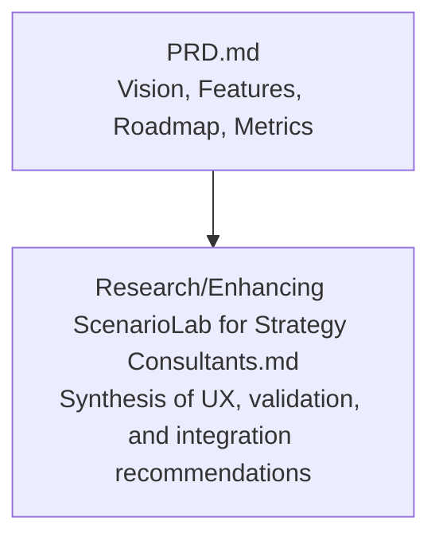
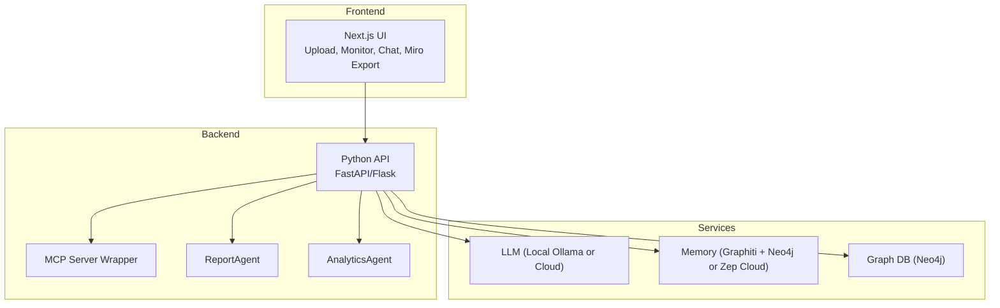
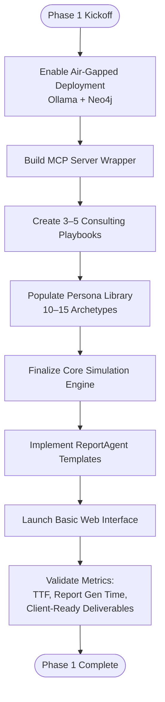
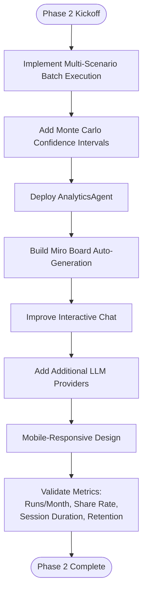
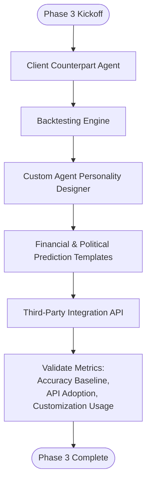
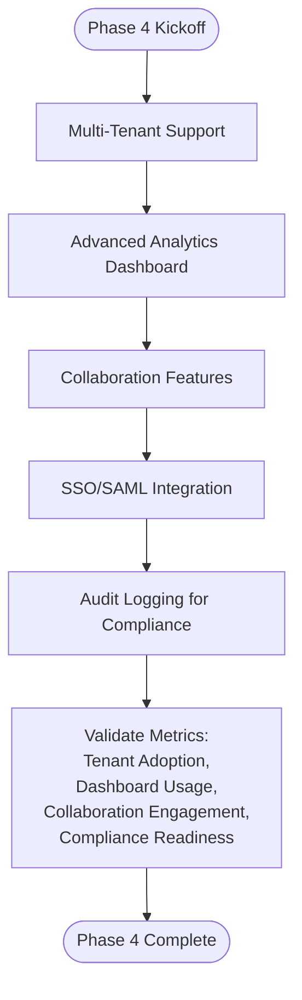
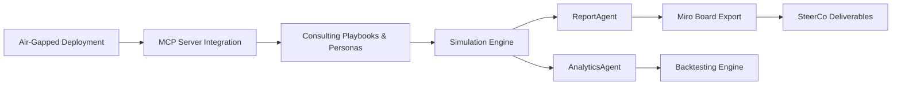

# Implementation Roadmap

<cite>
**Referenced Files in This Document**
- [PRD.md](file://PRD.md)
- [Enhancing ScenarioLab for Strategy Consultants.md](file://Research/Enhancing ScenarioLab for Strategy Consultants.md)
</cite>

## Table of Contents
1. [Introduction](#introduction)
2. [Project Structure](#project-structure)
3. [Core Components](#core-components)
4. [Architecture Overview](#architecture-overview)
5. [Detailed Component Analysis](#detailed-component-analysis)
6. [Dependency Analysis](#dependency-analysis)
7. [Performance Considerations](#performance-considerations)
8. [Troubleshooting Guide](#troubleshooting-guide)
9. [Conclusion](#conclusion)
10. [Appendices](#appendices)

## Introduction
This Implementation Roadmap documents ScenarioLab’s phased development approach from MVP to Enterprise deployment. It aligns strategic goals with tactical delivery, leveraging consulting playbooks, agent archetypes, and SteerCo-ready deliverables. The roadmap defines phase-specific deliverables, success metrics, timelines, and interdependencies to guide product management and development teams.

## Project Structure
ScenarioLab is organized around a clear product vision and feature set tailored to strategy consultants and enterprise decision-makers. The PRD outlines the core features, technical architecture, and roadmap, while the research document synthesizes recommendations for air-gapped deployment, MCP integration, and consulting-grade outputs.

**Diagram sources**
- [PRD.md:13-35](file://PRD.md#L13-L35)
- [Enhancing ScenarioLab for Strategy Consultants.md:37-L55]

**Section sources**
- [PRD.md:13-35](file://PRD.md#L13-L35)
- [Enhancing ScenarioLab for Strategy Consultants.md:37-L55]

## Core Components
- Core simulation engine with strategy-native environments and dynamic temporal memory
- Consulting persona library with calibrated agent archetypes
- ReportAgent producing consulting-grade deliverables (scenario matrices, risk registers, stakeholder heatmaps, executive summaries)
- MCP server integration enabling CLI/agentic workflows
- Air-gapped local deployment with Ollama + Neo4j replacing Zep Cloud
- Consulting playbooks for M&A, regulatory shock, competitive response, and boardroom rehearsals

**Section sources**
- [PRD.md:39-112](file://PRD.md#L39-L112)
- [PRD.md:301-336](file://PRD.md#L301-L336)
- [PRD.md:397-423](file://PRD.md#L397-L423)

## Architecture Overview
ScenarioLab follows a layered architecture: frontend (Next.js), backend API (Python), and integrated services for LLM, memory, and graph DB. The MCP server wraps the backend for CLI integration, and Miro board export integrates with Miro’s REST API for SteerCo-ready deliverables.

**Diagram sources**
- [PRD.md:131-187](file://PRD.md#L131-L187)
- [PRD.md:307-317](file://PRD.md#L307-L317)

**Section sources**
- [PRD.md:131-187](file://PRD.md#L131-L187)
- [PRD.md:307-317](file://PRD.md#L307-L317)

## Detailed Component Analysis

### Phase 1: MVP (30-Day Sprint)
Focus: Establish core simulation engine, basic web interface, and report generation; enable air-gapped local deployment and MCP server wrapper; introduce consulting playbooks and persona library.

Deliverables
- Core simulation engine with strategy-native environments and dynamic temporal memory
- Basic web interface for upload, monitor, and chat
- Report generation producing consulting-grade deliverables
- Air-gapped local deployment (Ollama + Neo4j replacing Zep Cloud)
- MCP server wrapper around the FastAPI backend
- 3–5 consulting playbook templates (M&A culture clash, regulatory shock test, competitive response war game)
- Consulting persona library with 10–15 archetypes
- Structured deliverable templates for ReportAgent

Success Metrics
- Time to first simulation: < 15 minutes
- Report generation time: < 30 seconds
- Client-ready deliverable rate: 90%+
- MCP integration readiness: Claude Desktop, Cursor, IDE
- Air-gapped deployment success: 100% for F100 banking clients

Timeline Expectations
- 30 days for MVP launch
- Prioritize air-gapped deployment and MCP wrapper to unlock enterprise workflows

Dependencies
- MCP server depends on backend API stability
- ReportAgent depends on simulation engine outputs
- Consulting playbooks depend on persona library and environment scaffolding

**Diagram sources**
- [PRD.md:303-311](file://PRD.md#L303-L311)
- [PRD.md:397-423](file://PRD.md#L397-L423)
- [PRD.md:425-434](file://PRD.md#L425-L434)

**Section sources**
- [PRD.md:303-311](file://PRD.md#L303-L311)
- [PRD.md:397-423](file://PRD.md#L397-L423)
- [PRD.md:425-434](file://PRD.md#L425-L434)
- [Enhancing ScenarioLab for Strategy Consultants.md:51-55](file://Research/Enhancing ScenarioLab for Strategy Consultants.md#L51-L55)

### Phase 2: Enhanced Experience
Focus: Multi-scenario batch execution, Monte Carlo confidence intervals, AnalyticsAgent, Miro board auto-generation, and improved interactive chat.

Deliverables
- Multi-scenario batch execution with comparison views
- Monte Carlo confidence intervals
- AnalyticsAgent for quantitative metrics extraction (% compliance violation, time-to-consensus, sentiment drop)
- Miro board auto-generation with frames, app cards, sticky notes
- Interactive chat improvements
- Additional LLM provider support
- Mobile-responsive design

Success Metrics
- Simulation runs: 5000+ per month
- Report sharing rate: 30%+
- Average session duration: 15+ minutes
- User retention (7-day): 40%+

Timeline Expectations
- 60–90 days for Phase 2 delivery

Dependencies
- AnalyticsAgent depends on simulation state monitoring
- Miro board export depends on MCP outputs and Miro REST API integration
- Batch execution depends on simulation engine scalability

**Diagram sources**
- [PRD.md:313-320](file://PRD.md#L313-L320)
- [PRD.md:343-347](file://PRD.md#L343-L347)

**Section sources**
- [PRD.md:313-320](file://PRD.md#L313-L320)
- [PRD.md:343-347](file://PRD.md#L343-L347)

### Phase 3: Advanced Features
Focus: Client Counterpart Agent for executive presentation rehearsals, backtesting engine, custom agent personality designer, and API for third-party integrations.

Deliverables
- Client Counterpart Agent for rehearsing executive presentations
- Backtesting engine against historical events
- Custom agent personality designer
- Financial prediction templates
- Political news prediction models
- API for third-party integrations

Success Metrics
- Simulation accuracy baseline established via backtesting
- API adoption rate among partners
- Personality customization usage

Timeline Expectations
- 90–120 days for Phase 3 delivery

Dependencies
- Backtesting depends on historical event datasets and evaluation metrics
- API depends on MCP server stability and documented endpoints
- Personality designer depends on agent configuration interfaces

**Diagram sources**
- [PRD.md:322-328](file://PRD.md#L322-L328)

**Section sources**
- [PRD.md:322-328](file://PRD.md#L322-L328)

### Phase 4: Enterprise
Focus: Multi-tenancy, advanced analytics dashboard, collaboration features, SSO/SAML integration, and audit logging for compliance.

Deliverables
- Multi-tenant support
- Advanced analytics dashboard
- Collaboration features
- SSO/SAML integration
- Audit logging for compliance

Success Metrics
- Multi-tenant onboarding success
- Dashboard adoption and insights usage
- Collaboration feature engagement
- Compliance audit readiness

Timeline Expectations
- 120–180 days for Phase 4 delivery

Dependencies
- Multi-tenancy depends on isolation and tenant configuration
- SSO/SAML depends on identity provider integrations
- Audit logging depends on standardized event capture

**Diagram sources**
- [PRD.md:330-335](file://PRD.md#L330-L335)

**Section sources**
- [PRD.md:330-335](file://PRD.md#L330-L335)

## Dependency Analysis
Inter-phase dependencies and integration touchpoints:

- MCP server wrapper unlocks CLI/agentic workflows and steers UX priorities
- Air-gapped deployment enables enterprise trust and reduces cloud dependencies
- Consulting playbooks and persona library scaffold strategy-native environments
- AnalyticsAgent and backtesting bridge qualitative outputs with quantitative rigor
- Miro board export provides SteerCo-ready deliverables for client presentations

**Diagram sources**
- [PRD.md:307-317](file://PRD.md#L307-L317)
- [PRD.md:315-324](file://PRD.md#L315-L324)
- [PRD.md:343-347](file://PRD.md#L343-L347)

**Section sources**
- [PRD.md:307-317](file://PRD.md#L307-L317)
- [PRD.md:315-324](file://PRD.md#L315-L324)
- [PRD.md:343-347](file://PRD.md#L343-L347)

## Performance Considerations
- Simulation initialization: < 60 seconds
- Report generation: < 30 seconds
- Concurrent users: 100+
- Page load time: < 3 seconds
- API response time: < 500ms p95

These targets inform backend scaling, memory management, and caching strategies across phases.

**Section sources**
- [PRD.md:222-231](file://PRD.md#L222-L231)

## Troubleshooting Guide
Common issues and mitigation strategies aligned with the roadmap:

- MCP server not responding
  - Verify backend API stability and environment variables
  - Confirm MCP server enabled flag and port availability
- Air-gapped deployment failures
  - Validate Ollama base URL and model name
  - Ensure Neo4j connectivity and credentials
- Report generation delays
  - Optimize simulation runtime and memory usage
  - Reduce report complexity or parallelize generation
- Miro board export errors
  - Check Miro API token and permissions
  - Validate board export payload and template mapping
- AnalyticsAgent missing metrics
  - Confirm simulation state monitoring hooks
  - Validate metric extraction logic and thresholds

**Section sources**
- [PRD.md:277-291](file://PRD.md#L277-L291)
- [PRD.md:292-298](file://PRD.md#L292-L298)

## Conclusion
ScenarioLab’s phased roadmap balances rapid MVP delivery with enterprise-readiness. By prioritizing air-gapped deployment, MCP integration, consulting playbooks, and SteerCo deliverables, the project accelerates adoption among strategy consultants while laying the foundation for advanced analytics, collaboration, and multi-tenancy. Success metrics provide clear targets for user acquisition, simulation volume, session duration, and retention, ensuring measurable progress across phases.

## Appendices

### Success Metrics Summary
- User signups: 1000 in first 3 months
- Simulation runs: 5000+ per month
- Average session duration: 15+ minutes
- Report sharing rate: 30%+
- User retention (7-day): 40%+

**Section sources**
- [PRD.md:339-347](file://PRD.md#L339-L347)

### Consulting Playbook Templates
- M&A Culture Clash Simulation
- Regulatory Shock Test
- Competitive Response War Game
- Boardroom Decision Rehearsal

**Section sources**
- [PRD.md:397-423](file://PRD.md#L397-L423)