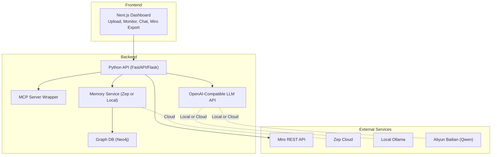
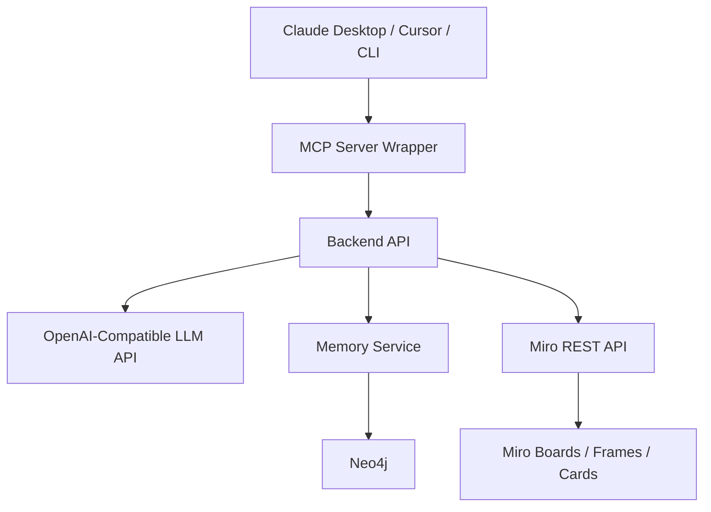
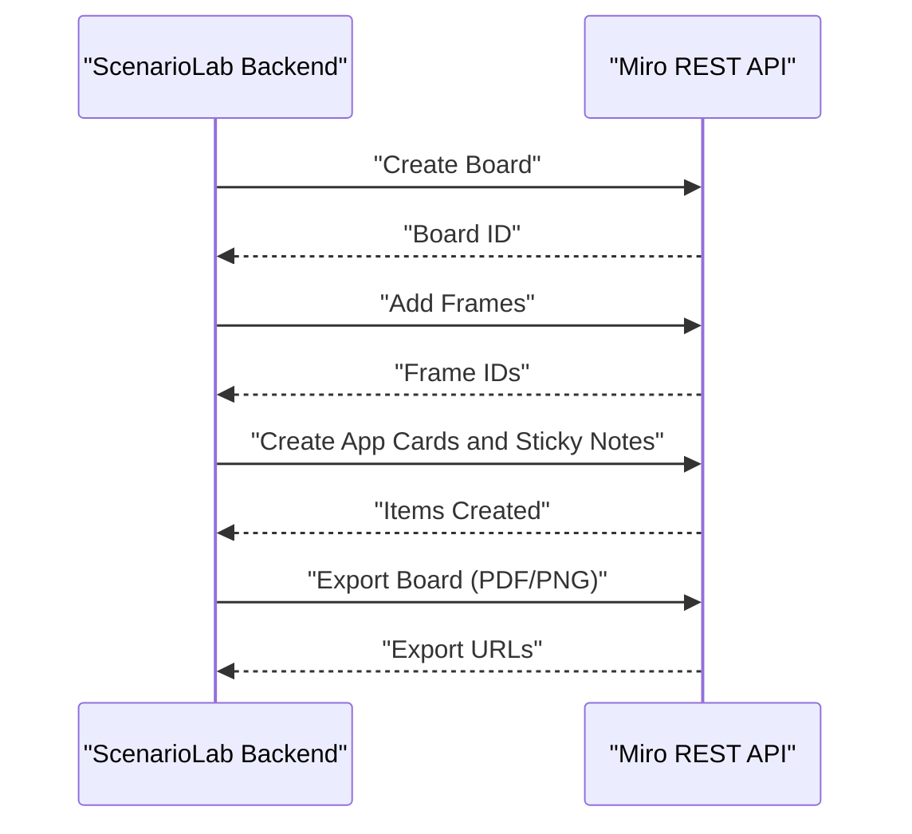
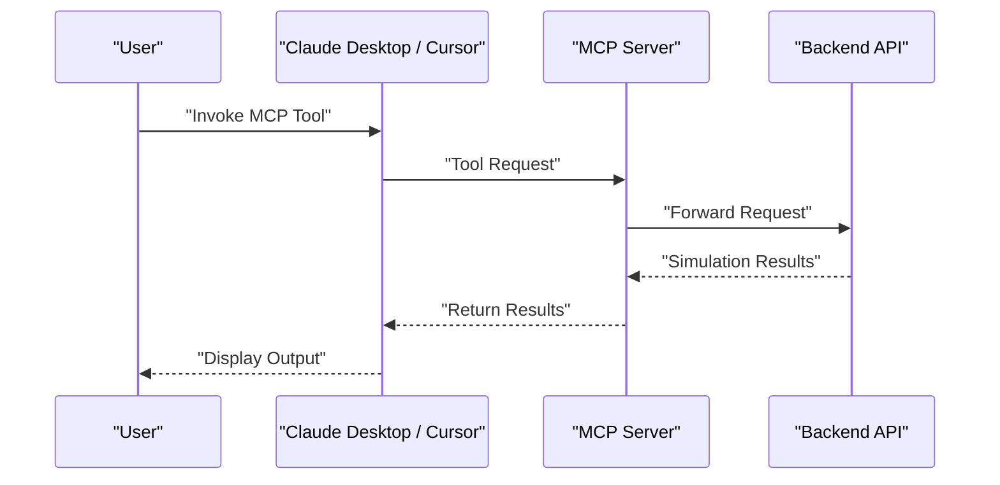
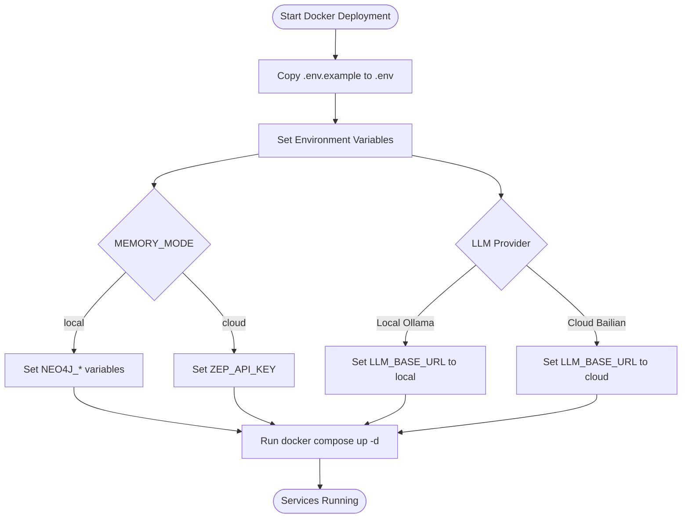
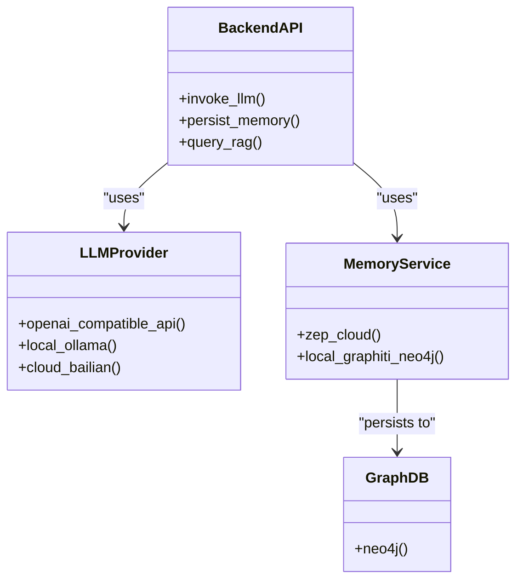
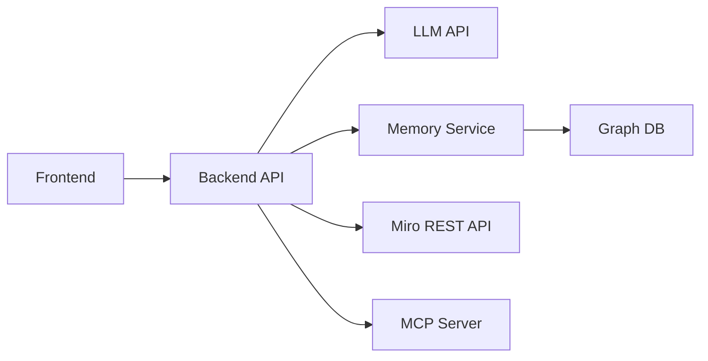

# Integration Guides

<cite>
**Referenced Files in This Document**
- [PRD.md](file://PRD.md)
- [Enhancing ScenarioLab for Strategy Consultants.md](file://Research/Enhancing ScenarioLab for Strategy Consultants.md)
</cite>

## Table of Contents
1. [Introduction](#introduction)
2. [Project Structure](#project-structure)
3. [Core Components](#core-components)
4. [Architecture Overview](#architecture-overview)
5. [Detailed Component Analysis](#detailed-component-analysis)
6. [Dependency Analysis](#dependency-analysis)
7. [Performance Considerations](#performance-considerations)
8. [Troubleshooting Guide](#troubleshooting-guide)
9. [Conclusion](#conclusion)
10. [Appendices](#appendices)

## Introduction
This Integration Guide provides step-by-step instructions and configuration guidance for ScenarioLab’s external integrations and deployment options. It covers:
- Miro API integration for board export and frame-based content automation
- MCP server setup for CLI integration with Claude Desktop and Cursor
- Local deployment configuration with Docker and environment variables
- Third-party service integration patterns for LLMs and memory services
- Authentication methods, environment variables, and service dependencies
- Practical examples aligned with consulting workflows and development environments
- Troubleshooting guidance for both cloud and air-gapped scenarios

## Project Structure
ScenarioLab is a strategic simulation platform with a frontend built on Next.js and a Python-based backend. Integrations primarily surface through:
- Miro REST API for exporting simulation outputs to boards and frames
- MCP server wrapper enabling invocation from Claude Desktop, Cursor, and CLI pipelines
- OpenAI-compatible LLM APIs (local Ollama or cloud providers)
- Memory services (Zep Cloud or local Graphiti + Neo4j)

**Diagram sources**
- [PRD.md:131-187](file://PRD.md#L131-L187)
- [PRD.md:253-298](file://PRD.md#L253-L298)

**Section sources**
- [PRD.md:131-187](file://PRD.md#L131-L187)
- [PRD.md:253-298](file://PRD.md#L253-L298)

## Core Components
- Miro REST API integration for board export and frame-based content automation
- MCP server wrapper for agentic workflows and CLI integration
- OpenAI-compatible LLM API configuration (local Ollama or cloud Bailian)
- Memory service abstraction (Zep Cloud or local Graphiti + Neo4j)
- Docker-based deployment with environment variables

**Section sources**
- [PRD.md:131-187](file://PRD.md#L131-L187)
- [PRD.md:253-298](file://PRD.md#L253-L298)

## Architecture Overview
The integration architecture centers on the Python backend exposing:
- Miro export endpoints for board creation and frame manipulation
- MCP server endpoints for invoking simulations from Claude Desktop/Cursor
- LLM API endpoints compatible with OpenAI SDK
- Memory and graph database layers supporting agent memory and RAG

**Diagram sources**
- [PRD.md:131-187](file://PRD.md#L131-L187)
- [PRD.md:253-298](file://PRD.md#L253-L298)

## Detailed Component Analysis

### Miro API Integration for Board Export and Frame-Based Content Automation
ScenarioLab integrates with Miro’s REST API to:
- Export simulation outputs to Miro boards
- Create frames, app cards, sticky notes, and connectors programmatically
- Automate content layout for SteerCo-ready deliverables

Key integration aspects:
- Authentication via Miro API token
- Board export and item management endpoints
- Frame-based content automation for initiative tracking and evidence clustering

Setup steps:
1. Obtain a Miro API token from your Miro account.
2. Set the environment variable for the Miro API token.
3. Trigger board export from the backend after simulation completion.
4. Use frame-based automation to place app cards and sticky notes for evidence and action items.

Environment variables:
- Miro API token: [PRD.md:289](file://PRD.md#L289)

References:
- Miro REST API overview and board export: [Enhancing ScenarioLab for Strategy Consultants.md:124](file://Research/Enhancing ScenarioLab for Strategy Consultants.md#L124)
- Miro REST API reference guide: [Enhancing ScenarioLab for Strategy Consultants.md:107](file://Research/Enhancing ScenarioLab for Strategy Consultants.md#L107)
- Working with sticky notes and tags: [Enhancing ScenarioLab for Strategy Consultants.md:111](file://Research/Enhancing ScenarioLab for Strategy Consultants.md#L111)
- Getting items and boards: [Enhancing ScenarioLab for Strategy Consultants.md:140](file://Research/Enhancing ScenarioLab for Strategy Consultants.md#L140)

**Diagram sources**
- [PRD.md:208](file://PRD.md#L208)
- [PRD.md:289](file://PRD.md#L289)
- [Enhancing ScenarioLab for Strategy Consultants.md:124](file://Research/Enhancing ScenarioLab for Strategy Consultants.md#L124)

**Section sources**
- [PRD.md:208](file://PRD.md#L208)
- [PRD.md:289](file://PRD.md#L289)
- [Enhancing ScenarioLab for Strategy Consultants.md:107](file://Research/Enhancing ScenarioLab for Strategy Consultants.md#L107)
- [Enhancing ScenarioLab for Strategy Consultants.md:111](file://Research/Enhancing ScenarioLab for Strategy Consultants.md#L111)
- [Enhancing ScenarioLab for Strategy Consultants.md:124](file://Research/Enhancing ScenarioLab for Strategy Consultants.md#L124)
- [Enhancing ScenarioLab for Strategy Consultants.md:140](file://Research/Enhancing ScenarioLab for Strategy Consultants.md#L140)

### MCP Server Setup for CLI Integration with Claude Desktop and Cursor
ScenarioLab exposes an MCP server wrapper around the FastAPI backend to enable:
- Invoking simulations directly from Claude Desktop and Cursor
- Seamless integration into developer workflows and IDE pipelines

Setup steps:
1. Enable the MCP server by setting the MCP server enabled flag.
2. Configure the backend to expose MCP endpoints.
3. Connect Claude Desktop or Cursor to the MCP server.
4. Use MCP tools to trigger simulations and retrieve results.

Environment variables:
- MCP server enabled: [PRD.md:289](file://PRD.md#L289)

References:
- MCP server technology stack: [PRD.md:172](file://PRD.md#L172)
- MCP as a primary workflow entry point: [Enhancing ScenarioLab for Strategy Consultants.md:21](file://Research/Enhancing ScenarioLab for Strategy Consultants.md#L21)

**Diagram sources**
- [PRD.md:172](file://PRD.md#L172)
- [PRD.md:289](file://PRD.md#L289)
- [Enhancing ScenarioLab for Strategy Consultants.md:21](file://Research/Enhancing ScenarioLab for Strategy Consultants.md#L21)

**Section sources**
- [PRD.md:172](file://PRD.md#L172)
- [PRD.md:289](file://PRD.md#L289)
- [Enhancing ScenarioLab for Strategy Consultants.md:21](file://Research/Enhancing ScenarioLab for Strategy Consultants.md#L21)

### Local Deployment Configuration with Docker and Environment Variables
ScenarioLab supports local deployment using Docker and Docker Compose. The environment variables define LLM, memory, and optional Miro and MCP integrations.

Deployment options:
- Source code deployment for development
- Docker Compose deployment for production-like environments

Environment variables:
- LLM_API_KEY: [PRD.md:281](file://PRD.md#L281)
- LLM_BASE_URL: [PRD.md:282](file://PRD.md#L282)
- LLM_MODEL_NAME: [PRD.md:283](file://PRD.md#L283)
- MEMORY_MODE: [PRD.md:284](file://PRD.md#L284)
- ZEP_API_KEY: [PRD.md:285](file://PRD.md#L285)
- NEO4J_URI: [PRD.md:286](file://PRD.md#L286)
- NEO4J_USER: [PRD.md:287](file://PRD.md#L287)
- NEO4J_PASSWORD: [PRD.md:288](file://PRD.md#L288)
- MIRO_API_TOKEN: [PRD.md:289](file://PRD.md#L289)
- MCP_SERVER_ENABLED: [PRD.md:290](file://PRD.md#L290)

LLM and memory configuration:
- LLM configuration (OpenAI-compatible):
  - Local Ollama base URL: [PRD.md:181](file://PRD.md#L181)
  - Cloud Bailian base URL: [PRD.md:180](file://PRD.md#L180)
- Memory service:
  - Local Graphiti + Neo4j: [PRD.md:184](file://PRD.md#L184)
  - Cloud Zep: [PRD.md:185](file://PRD.md#L185)

**Diagram sources**
- [PRD.md:270-290](file://PRD.md#L270-L290)
- [PRD.md:180-181](file://PRD.md#L180-L181)
- [PRD.md:184-185](file://PRD.md#L184-L185)

**Section sources**
- [PRD.md:257-290](file://PRD.md#L257-L290)
- [PRD.md:180-181](file://PRD.md#L180-L181)
- [PRD.md:184-185](file://PRD.md#L184-L185)

### Third-Party Service Integration Patterns
- LLM API integration:
  - OpenAI SDK-compatible endpoints
  - Local Ollama or cloud Bailian
- Memory service integration:
  - Zep Cloud for cloud deployments
  - Graphiti + Neo4j for local deployments
- Graph DB integration:
  - Neo4j for knowledge graph and RAG

Technology stack and API requirements:
- LLM configuration: [PRD.md:174-181](file://PRD.md#L174-L181)
- Memory service: [PRD.md:183-186](file://PRD.md#L183-L186)
- Graph DB: [PRD.md:169-170](file://PRD.md#L169-L170)

**Diagram sources**
- [PRD.md:161-186](file://PRD.md#L161-L186)

**Section sources**
- [PRD.md:161-186](file://PRD.md#L161-L186)

## Dependency Analysis
- Frontend depends on backend APIs for simulation orchestration and report generation
- Backend depends on LLM API for reasoning and memory service for agent persistence
- Memory service depends on Graph DB for knowledge graph storage
- Optional integrations: Miro REST API for board export; MCP server for CLI workflows

**Diagram sources**
- [PRD.md:131-187](file://PRD.md#L131-L187)
- [PRD.md:253-298](file://PRD.md#L253-L298)

**Section sources**
- [PRD.md:131-187](file://PRD.md#L131-L187)
- [PRD.md:253-298](file://PRD.md#L253-L298)

## Performance Considerations
- Minimize round-trips to external services by batching requests where possible
- Cache frequently accessed LLM prompts and memory queries
- Use asynchronous processing for long-running tasks (simulation runs, board exports)
- Monitor LLM API usage and set rate limits to prevent throttling

[No sources needed since this section provides general guidance]

## Troubleshooting Guide
Common issues and resolutions:
- Miro API token invalid or missing
  - Verify token validity and permissions; ensure the environment variable is set
  - References: [PRD.md:289](file://PRD.md#L289)
- MCP server not reachable
  - Confirm MCP server is enabled and backend exposes MCP endpoints
  - References: [PRD.md:289](file://PRD.md#L289), [PRD.md:172](file://PRD.md#L172)
- LLM API connectivity failures
  - Check base URL and model name; ensure local Ollama is running or cloud credentials are valid
  - References: [PRD.md:180-181](file://PRD.md#L180-L181), [PRD.md:282-283](file://PRD.md#L282-L283)
- Memory service errors
  - For local mode, verify Neo4j connection parameters; for cloud mode, confirm Zep API key
  - References: [PRD.md:284-288](file://PRD.md#L284-L288), [PRD.md:184-185](file://PRD.md#L184-L185)
- Docker deployment issues
  - Ensure environment variables are configured before starting services
  - References: [PRD.md:270-275](file://PRD.md#L270-L275)

**Section sources**
- [PRD.md:180-181](file://PRD.md#L180-L181)
- [PRD.md:270-290](file://PRD.md#L270-L290)
- [PRD.md:282-288](file://PRD.md#L282-L288)
- [PRD.md:172](file://PRD.md#L172)

## Conclusion
ScenarioLab’s integration landscape combines Miro’s board automation, MCP-based CLI workflows, and flexible LLM/memory backends. By configuring environment variables correctly and leveraging Docker, teams can deploy ScenarioLab in both cloud and air-gapped environments. The integration patterns outlined here enable seamless incorporation into consulting workflows and development pipelines.

[No sources needed since this section summarizes without analyzing specific files]

## Appendices

### Environment Variables Reference
- LLM_API_KEY: Conditional; required for cloud LLM providers
- LLM_BASE_URL: Required; OpenAI-compatible base URL (local or cloud)
- LLM_MODEL_NAME: Required; model identifier (e.g., qwen-plus, llama3.1)
- MEMORY_MODE: Required; local (Neo4j) or cloud (Zep)
- ZEP_API_KEY: Conditional; required when MEMORY_MODE=cloud
- NEO4J_URI: Conditional; required when MEMORY_MODE=local
- NEO4J_USER: Conditional; required when MEMORY_MODE=local
- NEO4J_PASSWORD: Conditional; required when MEMORY_MODE=local
- MIRO_API_TOKEN: Optional; for Miro board export
- MCP_SERVER_ENABLED: Optional; enable MCP server integration

**Section sources**
- [PRD.md:277-290](file://PRD.md#L277-L290)

### API Endpoint Specifications
- LLM API: OpenAI SDK-compatible endpoints
  - Local base URL: [PRD.md:181](file://PRD.md#L181)
  - Cloud base URL: [PRD.md:180](file://PRD.md#L180)
- Memory Service: Local Graphiti + Neo4j or Cloud Zep
  - Local: [PRD.md:184](file://PRD.md#L184)
  - Cloud: [PRD.md:185](file://PRD.md#L185)
- Miro REST API: Board export and item management
  - References: [Enhancing ScenarioLab for Strategy Consultants.md:107](file://Research/Enhancing ScenarioLab for Strategy Consultants.md#L107), [Enhancing ScenarioLab for Strategy Consultants.md:124](file://Research/Enhancing ScenarioLab for Strategy Consultants.md#L124)

**Section sources**
- [PRD.md:174-186](file://PRD.md#L174-L186)
- [PRD.md:180-181](file://PRD.md#L180-L181)
- [Enhancing ScenarioLab for Strategy Consultants.md:107](file://Research/Enhancing ScenarioLab for Strategy Consultants.md#L107)
- [Enhancing ScenarioLab for Strategy Consultants.md:124](file://Research/Enhancing ScenarioLab for Strategy Consultants.md#L124)