# MiroFish Product Requirements Document (PRD)

<cite>
**Referenced Files in This Document**
- [PRD.md](file://PRD.md)
- [Enhancing MiroFish for Strategy Consultants.md](file://Research/Enhancing MiroFish for Strategy Consultants.md)
</cite>

## Table of Contents
1. [Introduction](#introduction)
2. [Project Structure](#project-structure)
3. [Core Components](#core-components)
4. [Architecture Overview](#architecture-overview)
5. [Detailed Component Analysis](#detailed-component-analysis)
6. [Dependency Analysis](#dependency-analysis)
7. [Performance Considerations](#performance-considerations)
8. [Troubleshooting Guide](#troubleshooting-guide)
9. [Conclusion](#conclusion)
10. [Appendices](#appendices)

## Introduction
MiroFish is an AI-powered strategic simulation and war-gaming platform designed for strategy consultants and enterprise decision-makers. It functions as an AI decision lab for scenario rehearsal and strategic stress-testing, constructing high-fidelity parallel digital worlds where intelligent agents—modeled after real-world stakeholders—interact in strategy-native environments (boardrooms, negotiations, war games) to help consultants test decisions before real-world implementation. The platform emphasizes consulting-grade deliverables, including scenario matrices, risk registers, stakeholder heatmaps, and executive summaries, and positions itself as a transformation from traditional $50K–$200K war-gaming engagements into on-demand, repeatable capabilities.

## Project Structure
This PRD consolidates product vision, feature specifications, technical architecture, and operational requirements for MiroFish. It includes:
- Executive summary and product vision
- Core features with priorities and detailed specifications
- Technical architecture and technology stack
- User experience flows and interfaces
- Non-functional requirements (performance, security, scalability, reliability)
- Deployment options and environment variables
- Roadmap and success metrics
- Consulting playbook templates and glossary

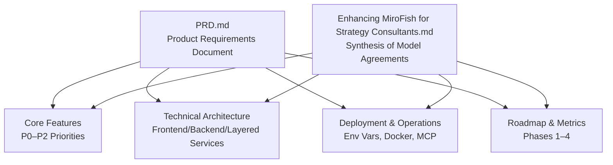

**Diagram sources**
- [PRD.md](file://PRD.md)
- [Enhancing MiroFish for Strategy Consultants.md](file://Research/Enhancing MiroFish for Strategy Consultants.md)

**Section sources**
- [PRD.md:1-396](file://PRD.md#L1-L396)
- [Enhancing MiroFish for Strategy Consultants.md:1-273](file://Research/Enhancing MiroFish for Strategy Consultants.md#L1-L273)

## Core Components
MiroFish’s core features are organized by priority and aligned to strategy consulting workflows. Below are the P0 features with user stories, requirements, acceptance criteria, and technical implementation details.

- Graph Building Engine (P0)
  - User story: As a user, I want to upload seed materials so the system can extract entities and relationships for simulation.
  - Requirements:
    - Support text documents, reports, and narrative content as seed input
    - Automatic entity extraction and relationship mapping
    - Individual and collective memory injection for agents
    - GraphRAG construction for knowledge retrieval
  - Acceptance criteria:
    - System processes seed materials within 60 seconds for documents under 10MB
    - Extracts minimum 80% of key entities mentioned in the source
    - Constructs navigable knowledge graph with relationship weights

- Multi-Agent Simulation (P0)
  - User story: As a user, I want to run simulations with thousands of agents that interact and evolve over time.
  - Requirements:
    - Generate agents with consulting-specific archetypes (CEO, CFO, regulator, competitor exec, activist investor, union rep, media stakeholder)
    - Support strategy-native environments: boardroom debates, war games, negotiations, M&A integration scenarios
    - Dynamic temporal memory updates as simulation progresses
    - Configurable simulation rounds (recommended: 50–200 well-structured agents for consulting scenarios)
    - Real-time monitoring of agent interactions and emergent behaviors
    - Calibrate swarm demographics to mirror actual client org structure (10% risk officers, 60% front-office, 30% back-office)
  - Acceptance criteria:
    - Support 50–200 concurrent agents per simulation (optimized for consulting use cases)
    - Agents demonstrate believable boardroom and negotiation behaviors
    - Simulation state persists and can be resumed
    - Memory updates reflect agent experiences accurately
    - Environment supports structured round-based interactions (proposal → critique → counter-proposal → vote)

- Report Generation (P0)
  - User story: As a user, I want to receive detailed prediction reports after simulation completion.
  - Requirements:
    - ReportAgent with rich toolset for environment analysis
    - Consulting-grade deliverables: scenario matrices, risk registers, stakeholder heatmaps, executive summaries
    - Deep interaction with post-simulation environment
    - Assumption registers with evidence tracing
    - Human-review checkpoints at each pipeline stage
    - Export capabilities (PDF, Markdown, JSON, Miro board)
  - Acceptance criteria:
    - Reports generated within 30 seconds of simulation completion
    - Include at least 5 distinct prediction outcomes with probabilities
    - Provide reasoning chains for each prediction
    - Support natural language querying of results
    - Deliverables formatted for direct client presentation (SteerCo-ready)

- Consulting Persona Library (P0)
  - User story: As a user, I want to select from pre-built agent archetypes to model real-world stakeholders.
  - Requirements:
    - Pre-built agent archetypes: CEO, CFO, regulator, competitor exec, activist investor, union rep
    - Calibrate swarm demographics to mirror actual client organizational structure (via HR system exports)
  - Acceptance criteria:
    - Archetypes reflect realistic stakeholder roles and behaviors
    - Population distribution aligns with client org structure for structurally faithful simulations

- Air-Gapped Local Deployment (P0)
  - User story: As a user, I want to deploy MiroFish locally to meet confidentiality requirements.
  - Requirements:
    - Replace Zep Cloud + Chinese LLM APIs with local Ollama + Neo4j/Graphiti
    - Single change to point LLM_BASE_URL to local inference endpoint
  - Acceptance criteria:
    - Local deployment supports enterprise-grade confidentiality
    - Community-tested pattern (Ollama + Neo4j) validated for offline use

- MCP Server Integration (P0)
  - User story: As a user, I want to invoke simulations directly from Claude Desktop, Cursor, or CLI pipelines.
  - Requirements:
    - FastAPI-based MCP wrapper exposing MiroFish as MCP tools
    - Seamless integration with agentic workflows
  - Acceptance criteria:
    - MCP server enabled via environment variable
    - Integrations with Claude Desktop, Cursor, and IDE pipelines

- Interactive Chat (P1)
  - User story: As a user, I want to chat with individual agents to understand their perspectives and motivations.
  - Requirements:
    - Select and chat with any agent from the simulation
    - Agents respond based on their simulated experiences and personality
    - Chat history persistence per simulation
    - Context-aware responses referencing simulation events
  - Acceptance criteria:
    - Response latency under 3 seconds
    - Agents maintain consistent personality throughout conversation
    - Reference specific simulation events when relevant
    - Support follow-up questions with context retention

- Multi-Scenario Batch Execution (P1)
  - User story: As a user, I want to compare scenarios side-by-side with Monte Carlo confidence intervals.
  - Requirements:
    - Batch execution of multiple scenarios
    - Side-by-side comparison views
    - Confidence intervals derived from repeated runs
  - Acceptance criteria:
    - Consistent comparison across scenarios
    - Statistical rigor for quantitative outputs

- Miro Board Auto-Generation (P1)
  - User story: As a user, I want to export simulation outputs to Miro boards with frames, app cards, and sticky notes.
  - Requirements:
    - Programmatic generation of frames, app cards, and sticky notes
    - Export to PDF for SteerCo-ready board packs
  - Acceptance criteria:
    - Boards export cleanly and are ready for client review
    - Visual deliverables align with Miro templates and APIs

- AnalyticsAgent (P1)
  - User story: As a user, I want to monitor swarm state changes for quantitative metrics extracted from simulation behavior.
  - Requirements:
    - Silent monitoring of simulation state
    - Extraction of metrics such as % compliance violation, time-to-consensus, sentiment drop
  - Acceptance criteria:
    - Metrics produced consistently during simulation
    - Bridge between qualitative narrative and quantitative outputs

**Section sources**
- [PRD.md:39-128](file://PRD.md#L39-L128)
- [PRD.md:397-422](file://PRD.md#L397-L422)
- [Enhancing MiroFish for Strategy Consultants.md:11-16](file://Research/Enhancing MiroFish for Strategy Consultants.md#L11-L16)
- [Enhancing MiroFish for Strategy Consultants.md:43-44](file://Research/Enhancing MiroFish for Strategy Consultants.md#L43-L44)
- [Enhancing MiroFish for Strategy Consultants.md:41](file://Research/Enhancing MiroFish for Strategy Consultants.md#L41)

## Architecture Overview
MiroFish follows a layered architecture with a Next.js frontend, a Python backend (FastAPI/Flask), and integrated services for LLMs, memory, and graph databases. The MCP server wraps the backend for CLI/agentic workflows. The architecture supports both cloud and local deployments, with air-gapped local stacks replacing Zep Cloud and external LLM APIs.

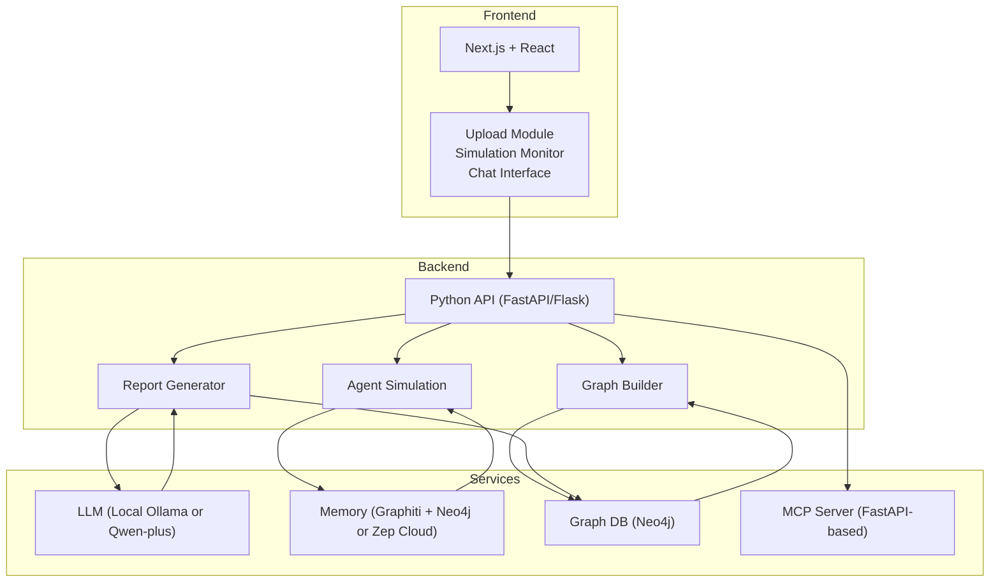

**Diagram sources**
- [PRD.md:131-187](file://PRD.md#L131-L187)

**Section sources**
- [PRD.md:131-187](file://PRD.md#L131-L187)

## Detailed Component Analysis

### Graph Building Engine
- Purpose: Seed extraction, memory injection, and GraphRAG construction for knowledge retrieval.
- Implementation details:
  - Accepts text documents, reports, and narrative content as seed input.
  - Performs automatic entity extraction and relationship mapping.
  - Injects individual and collective memory for agents.
  - Builds a navigable knowledge graph with relationship weights for retrieval.
- Acceptance criteria:
  - Processes seed materials within 60 seconds for documents under 10MB.
  - Extracts minimum 80% of key entities mentioned in the source.
  - Constructs a navigable knowledge graph with relationship weights.

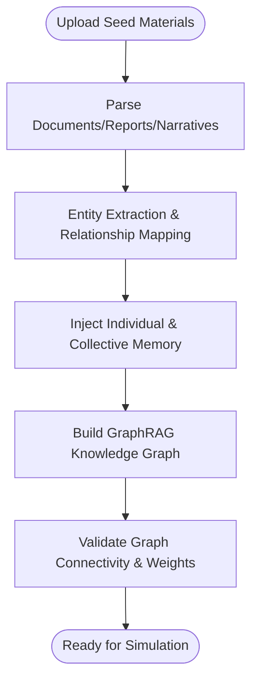

**Diagram sources**
- [PRD.md:60-74](file://PRD.md#L60-L74)

**Section sources**
- [PRD.md:60-74](file://PRD.md#L60-L74)

### Multi-Agent Simulation
- Purpose: Run strategy-native simulations with dynamic temporal memory and consulting-grade agent archetypes.
- Implementation details:
  - Generates agents with consulting-specific archetypes (CEO, CFO, regulator, competitor exec, activist investor, union rep, media stakeholder).
  - Supports strategy-native environments: boardroom debates, war games, negotiations, M&A integration scenarios.
  - Updates dynamic temporal memory as the simulation progresses.
  - Configurable simulation rounds (50–200 agents optimized for consulting).
  - Calibrates swarm demographics to mirror actual client org structure.
- Acceptance criteria:
  - Supports 50–200 concurrent agents per simulation.
  - Demonstrates believable boardroom and negotiation behaviors.
  - Simulation state persists and can be resumed.
  - Memory updates reflect agent experiences accurately.
  - Environment supports structured round-based interactions.

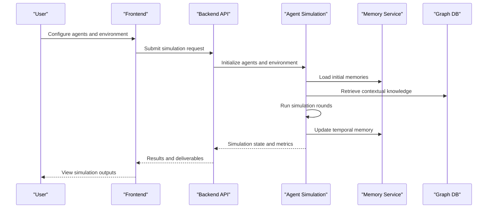

**Diagram sources**
- [PRD.md:75-93](file://PRD.md#L75-L93)

**Section sources**
- [PRD.md:75-93](file://PRD.md#L75-L93)
- [Enhancing MiroFish for Strategy Consultants.md:41](file://Research/Enhancing MiroFish for Strategy Consultants.md#L41)
- [Enhancing MiroFish for Strategy Consultants.md:43-44](file://Research/Enhancing MiroFish for Strategy Consultants.md#L43-L44)

### Report Generation
- Purpose: Produce consulting-grade deliverables with reasoning chains and export capabilities.
- Implementation details:
  - ReportAgent interacts deeply with the post-simulation environment.
  - Produces scenario matrices, risk registers, stakeholder heatmaps, and executive summaries.
  - Includes assumption registers with evidence tracing and human-review checkpoints.
  - Supports exports to PDF, Markdown, JSON, and Miro board.
- Acceptance criteria:
  - Reports generated within 30 seconds of simulation completion.
  - Includes at least 5 distinct prediction outcomes with probabilities.
  - Provides reasoning chains for each prediction.
  - Supports natural language querying of results.
  - Deliverables formatted for SteerCo-ready client presentation.

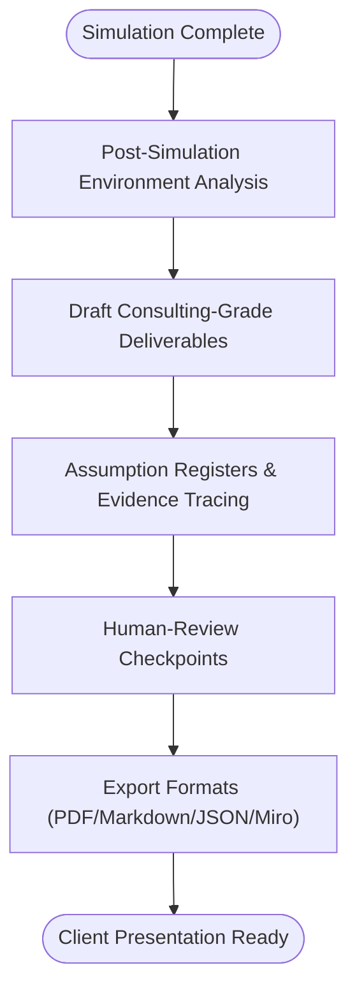

**Diagram sources**
- [PRD.md:94-112](file://PRD.md#L94-L112)

**Section sources**
- [PRD.md:94-112](file://PRD.md#L94-L112)

### Consulting Persona Library
- Purpose: Provide pre-built agent archetypes calibrated to real-world stakeholder roles.
- Implementation details:
  - Pre-built archetypes: CEO, CFO, regulator, competitor exec, activist investor, union rep.
  - Calibrate swarm demographics to mirror actual client organizational structure via HR system exports.
- Acceptance criteria:
  - Archetypes reflect realistic stakeholder roles and behaviors.
  - Population distribution aligns with client org structure for structurally faithful simulations.

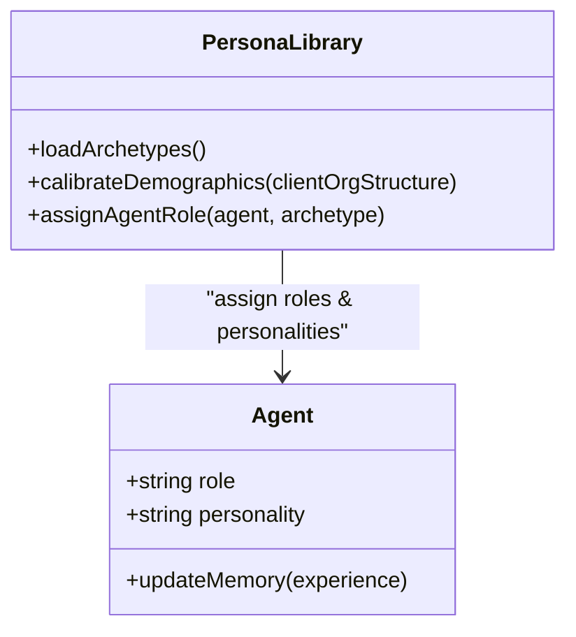

**Diagram sources**
- [PRD.md:48](file://PRD.md#L48)
- [PRD.md:80](file://PRD.md#L80)
- [Enhancing MiroFish for Strategy Consultants.md:43-44](file://Research/Enhancing MiroFish for Strategy Consultants.md#L43-L44)

**Section sources**
- [PRD.md:48](file://PRD.md#L48)
- [PRD.md:80](file://PRD.md#L80)
- [Enhancing MiroFish for Strategy Consultants.md:43-44](file://Research/Enhancing MiroFish for Strategy Consultants.md#L43-L44)

### Air-Gapped Local Deployment
- Purpose: Enable enterprise-ready on-premise deployment with Ollama + Neo4j to meet confidentiality requirements.
- Implementation details:
  - Replace Zep Cloud + Chinese LLM APIs with local Ollama + Neo4j/Graphiti.
  - Point LLM_BASE_URL to local inference endpoint.
- Acceptance criteria:
  - Local deployment supports enterprise-grade confidentiality.
  - Community-tested pattern (Ollama + Neo4j) validated for offline use.

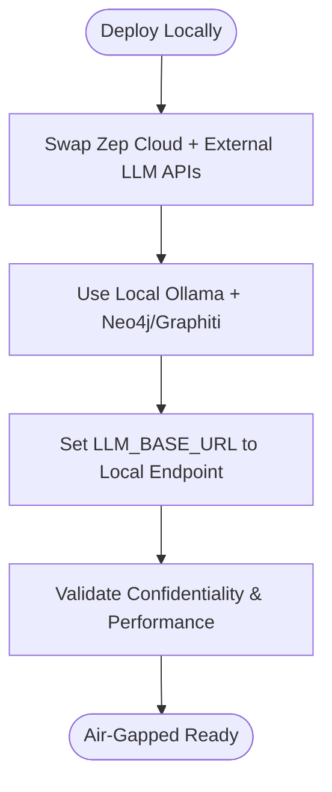

**Diagram sources**
- [PRD.md:49](file://PRD.md#L49)
- [PRD.md:176-186](file://PRD.md#L176-L186)
- [Enhancing MiroFish for Strategy Consultants.md:39-40](file://Research/Enhancing MiroFish for Strategy Consultants.md#L39-L40)

**Section sources**
- [PRD.md:49](file://PRD.md#L49)
- [PRD.md:176-186](file://PRD.md#L176-L186)
- [Enhancing MiroFish for Strategy Consultants.md:39-40](file://Research/Enhancing MiroFish for Strategy Consultants.md#L39-L40)

### MCP Server Integration
- Purpose: Expose MiroFish as MCP tools for CLI/agentic workflow integration.
- Implementation details:
  - FastAPI-based MCP wrapper around the backend.
  - Enables invoking simulations from Claude Desktop, Cursor, or existing CLI pipelines.
- Acceptance criteria:
  - MCP server enabled via environment variable.
  - Integrations with Claude Desktop, Cursor, and IDE pipelines.

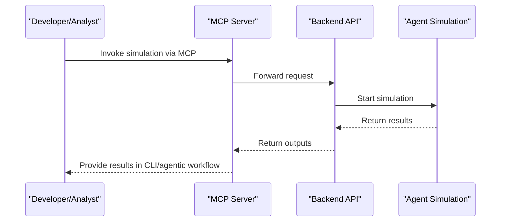

**Diagram sources**
- [PRD.md:50](file://PRD.md#L50)
- [PRD.md:172](file://PRD.md#L172)
- [PRD.md:289-290](file://PRD.md#L289-L290)

**Section sources**
- [PRD.md:50](file://PRD.md#L50)
- [PRD.md:172](file://PRD.md#L172)
- [PRD.md:289-290](file://PRD.md#L289-L290)

### Interactive Chat Interface
- Purpose: Allow users to chat with agents to understand perspectives and motivations.
- Implementation details:
  - Select and chat with any agent from the simulation.
  - Agents respond based on their simulated experiences and personality.
  - Chat history persists per simulation.
  - Responses are context-aware and reference simulation events.
- Acceptance criteria:
  - Response latency under 3 seconds.
  - Agents maintain consistent personality throughout conversation.
  - Reference specific simulation events when relevant.
  - Support follow-up questions with context retention.

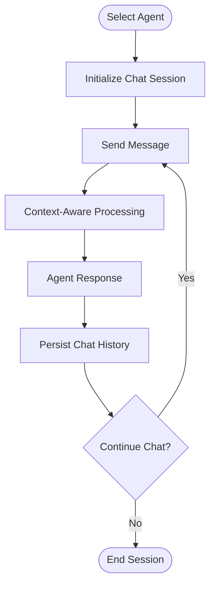

**Diagram sources**
- [PRD.md:113-128](file://PRD.md#L113-L128)

**Section sources**
- [PRD.md:113-128](file://PRD.md#L113-L128)

### Multi-Scenario Batch Execution
- Purpose: Compare scenarios side-by-side with Monte Carlo confidence intervals.
- Implementation details:
  - Batch execution of multiple scenarios.
  - Side-by-side comparison views.
  - Confidence intervals derived from repeated runs.
- Acceptance criteria:
  - Consistent comparison across scenarios.
  - Statistical rigor for quantitative outputs.

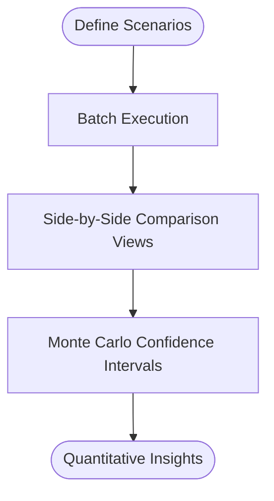

**Diagram sources**
- [PRD.md:52](file://PRD.md#L52)
- [PRD.md:314](file://PRD.md#L314)

**Section sources**
- [PRD.md:52](file://PRD.md#L52)
- [PRD.md:314](file://PRD.md#L314)

### Miro Board Auto-Generation
- Purpose: Export simulation outputs to Miro boards with frames, app cards, and sticky notes.
- Implementation details:
  - Programmatic generation of frames, app cards, and sticky notes.
  - Export to PDF for SteerCo-ready board packs.
- Acceptance criteria:
  - Boards export cleanly and are ready for client review.
  - Visual deliverables align with Miro templates and APIs.

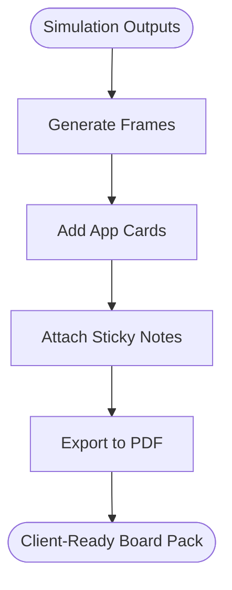

**Diagram sources**
- [PRD.md:53](file://PRD.md#L53)
- [Enhancing MiroFish for Strategy Consultants.md:45](file://Research/Enhancing MiroFish for Strategy Consultants.md#L45)

**Section sources**
- [PRD.md:53](file://PRD.md#L53)
- [Enhancing MiroFish for Strategy Consultants.md:45](file://Research/Enhancing MiroFish for Strategy Consultants.md#L45)

### AnalyticsAgent
- Purpose: Silently monitor swarm state changes to extract quantitative metrics.
- Implementation details:
  - Monitors simulation state continuously.
  - Extracts metrics such as % compliance violation, time-to-consensus, sentiment drop.
- Acceptance criteria:
  - Metrics produced consistently during simulation.
  - Bridge between qualitative narrative and quantitative outputs.

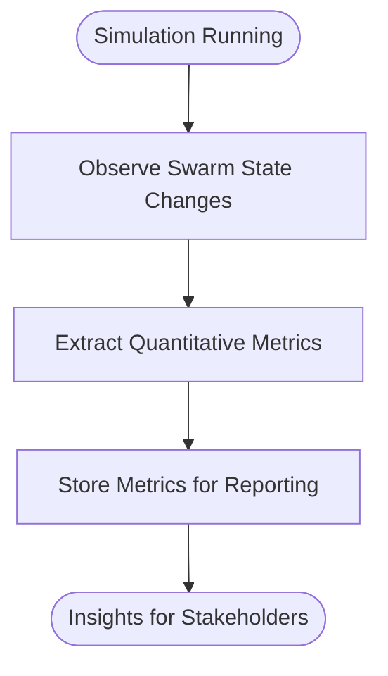

**Diagram sources**
- [PRD.md:54](file://PRD.md#L54)
- [PRD.md:316](file://PRD.md#L316)

**Section sources**
- [PRD.md:54](file://PRD.md#L54)
- [PRD.md:316](file://PRD.md#L316)

## Dependency Analysis
MiroFish integrates several technologies and services:
- Frontend: Next.js + React
- Backend: Python (FastAPI/Flask)
- LLM: OpenAI-compatible (local Ollama or Qwen-plus)
- Memory: Graphiti + Neo4j (local) or Zep Cloud
- Graph DB: Neo4j
- Containerization: Docker + Docker Compose
- MCP Server: FastAPI-based MCP wrapper

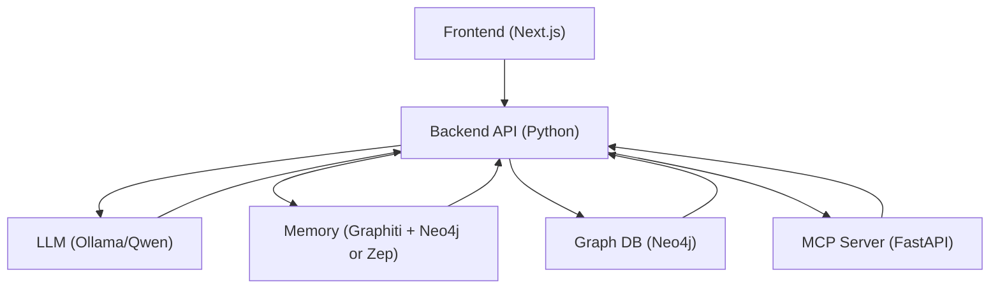

**Diagram sources**
- [PRD.md:161-172](file://PRD.md#L161-L172)

**Section sources**
- [PRD.md:161-172](file://PRD.md#L161-L172)

## Performance Considerations
- Page load time: < 3 seconds
- API response time: < 500ms (p95)
- Simulation initialization: < 60 seconds
- Report generation: < 30 seconds
- Concurrent users: 100+

Security, scalability, and reliability targets are documented in the PRD, including encryption, input validation, rate limiting, horizontal scaling, and graceful degradation.

**Section sources**
- [PRD.md:220-250](file://PRD.md#L220-L250)

## Troubleshooting Guide
Common operational concerns and mitigations:
- LLM API availability: Graceful degradation and automatic retry with exponential backoff.
- Memory service failures: Switch between local (Neo4j) and cloud (Zep) modes.
- Simulation performance: Optimize agent counts (50–200) and environment complexity.
- Export issues: Validate Miro API token and board export permissions.

**Section sources**
- [PRD.md:247-249](file://PRD.md#L247-L249)
- [PRD.md:289-290](file://PRD.md#L289-L290)

## Conclusion
MiroFish is positioned to transform strategic decision-making by enabling zero-risk scenario rehearsal in strategy-native environments. The PRD outlines a clear set of P0 features—Graph Building Engine, Multi-Agent Simulation, Report Generation, Consulting Persona Library, Air-Gapped Local Deployment, and MCP Server Integration—alongside P1 enhancements like Interactive Chat, Multi-Scenario Batch Execution, Miro Board Auto-Generation, and AnalyticsAgent. Together, these features deliver consulting-grade deliverables and integrate seamlessly into analyst and consultant workflows, while meeting enterprise confidentiality and performance requirements.

## Appendices

### Consulting Playbook Templates
- M&A Culture Clash Simulation
  - Use case: Pre-deal cultural integration assessment
  - Agents: Acquirer CEO, Target CEO, HR heads, key business unit leaders
  - Environment: Boardroom negotiation and integration planning sessions
  - Deliverables: Cultural alignment heatmap, integration risk register, stakeholder resistance forecast

- Regulatory Shock Test
  - Use case: Assess organizational response to new compliance requirements
  - Agents: CRO, Compliance officers, Business line heads, Regulators
  - Environment: Emergency response war room
  - Deliverables: Compliance violation probability matrix, time-to-remediation forecast, resource allocation recommendations

- Competitive Response War Game
  - Use case: Simulate competitor reactions to market entry or pricing move
  - Agents: Your strategy team, Competitor execs, Market analysts, Customers
  - Environment: Competitive intelligence war room
  - Deliverables: Competitor move probability tree, market share impact scenarios, counter-move recommendations

- Boardroom Decision Rehearsal
  - Use case: Prepare for high-stakes board presentations
  - Agents: Board members (by type: activist, institutional, independent), CEO, CFO
  - Environment: Board meeting simulation
  - Deliverables: Anticipated objection register, response strategy recommendations, approval probability

**Section sources**
- [PRD.md:397-422](file://PRD.md#L397-L422)

### Glossary
- Seed Material: Source documents used to initialize the simulation world
- GraphRAG: Graph-based Retrieval-Augmented Generation for knowledge retrieval
- Agent: AI entity with personality, memory, and behavioral logic
- Simulation Round: One iteration of agent interactions in the digital world
- Zep: Long-term memory service for AI applications
- MCP: Model Context Protocol for agentic workflow integration
- War Gaming: Structured simulation of competitive or strategic scenarios
- Strategy-Native Environment: Simulation setting designed for business strategy (boardroom, negotiation) vs. social media
- Consulting Archetype: Pre-defined agent persona based on common consulting stakeholders (CEO, CFO, regulator)
- SteerCo: Steering Committee – executive decision-making body
- AnalyticsAgent: Silent monitoring component that extracts quantitative metrics from swarm behavior

**Section sources**
- [PRD.md:366-383](file://PRD.md#L366-L383)