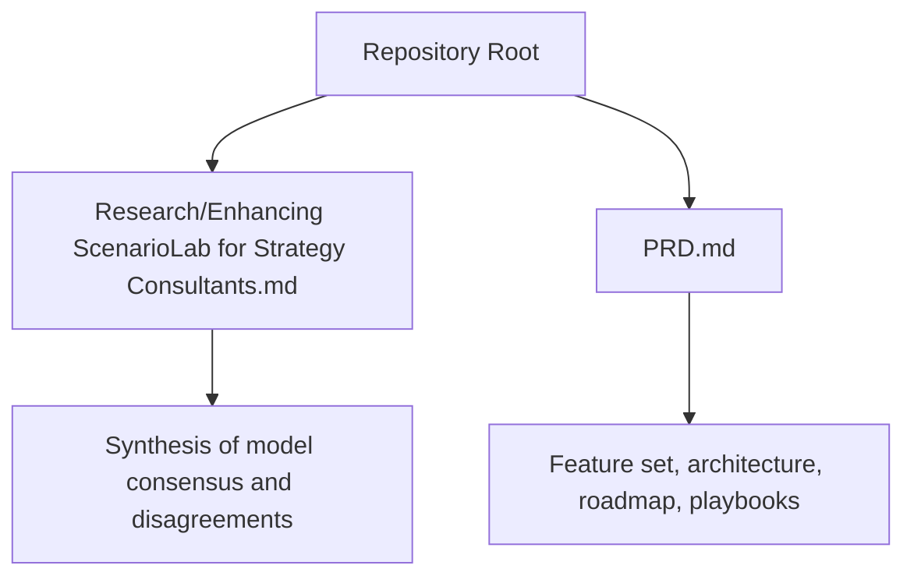
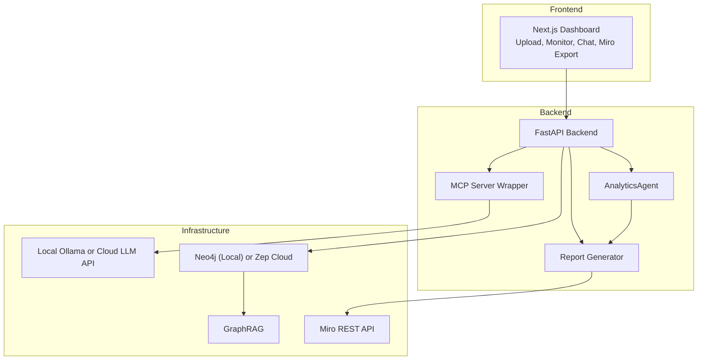
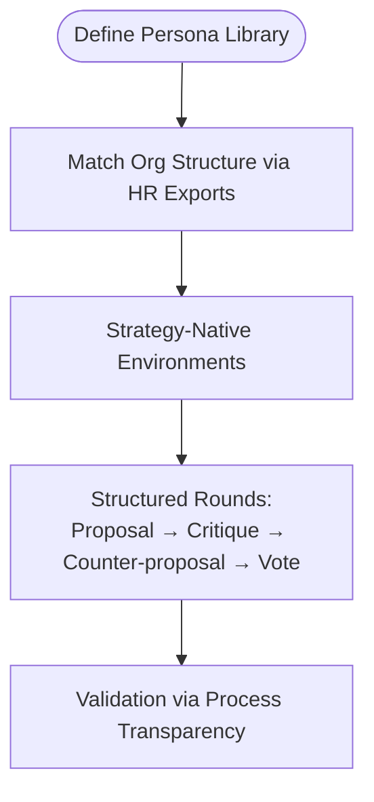
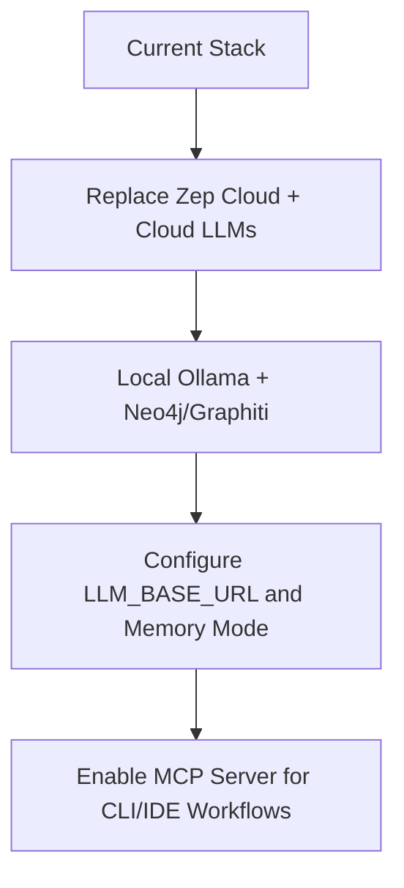
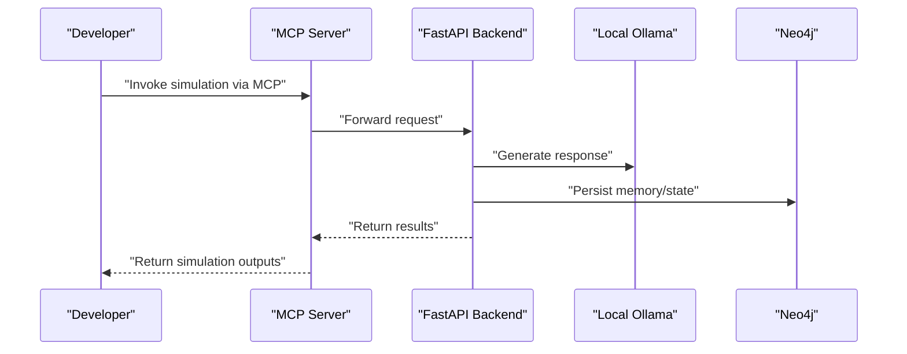
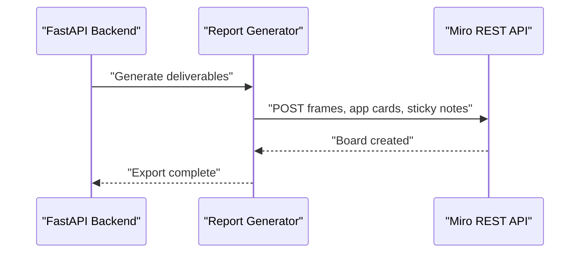
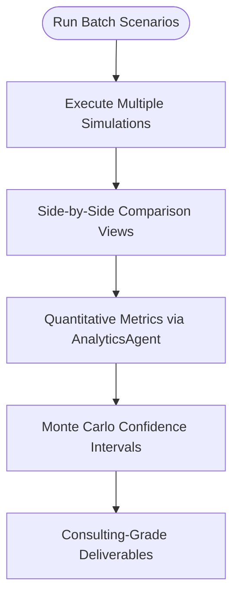
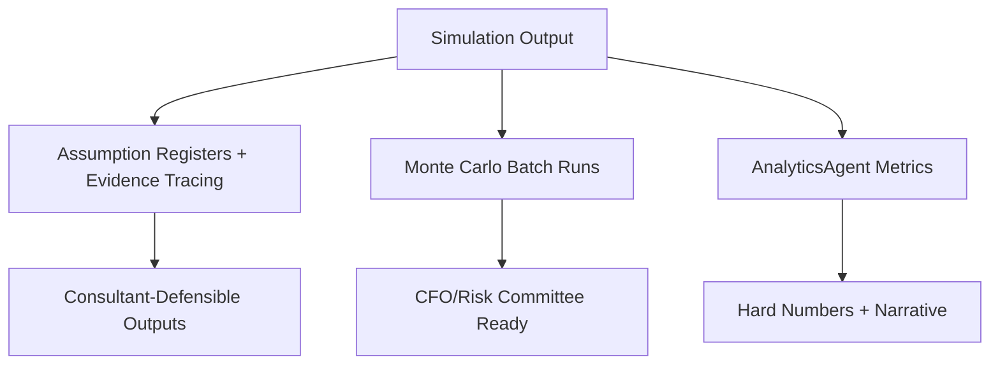
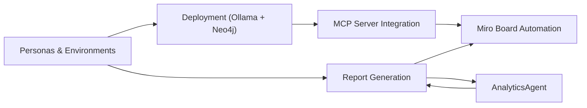

# Strategic Enhancement Guidelines

<cite>
**Referenced Files in This Document**
- [Research/Enhancing ScenarioLab for Strategy Consultants.md](file://Research/Enhancing ScenarioLab for Strategy Consultants.md)
- [PRD.md](file://PRD.md)
</cite>

## Table of Contents
1. [Introduction](#introduction)
2. [Project Structure](#project-structure)
3. [Core Components](#core-components)
4. [Architecture Overview](#architecture-overview)
5. [Detailed Component Analysis](#detailed-component-analysis)
6. [Dependency Analysis](#dependency-analysis)
7. [Performance Considerations](#performance-considerations)
8. [Troubleshooting Guide](#troubleshooting-guide)
9. [Conclusion](#conclusion)
10. [Appendices](#appendices)

## Introduction
This document provides strategic enhancement guidelines for ScenarioLab tailored to consulting workflows. It synthesizes findings across three models to define a consultative direction grounded in:
- Consulting-specific agent archetypes
- Local deployment requirements for financial services
- Miro integration patterns for board automation
- Batch execution and comparative analysis
- Analytics validation approaches aligned with strategy and finance needs

It also outlines strategic recommendations for:
- Air-gapped deployment with Ollama + Neo4j
- MCP server integration for Claude Desktop workflows
- Consulting-playbook templates for M&A, regulatory shock testing, and competitive response scenarios
- SteerCo-ready deliverables and strategy-native environments

## Project Structure
The repository consolidates two primary sources:
- A synthesis of three models’ recommendations for ScenarioLab’s strategic evolution
- A product requirements document (PRD) that defines features, architecture, and roadmap

**Section sources**
- [Research/Enhancing ScenarioLab for Strategy Consultants.md:1-273](file://Research/Enhancing ScenarioLab for Strategy Consultants.md#L1-L273)
- [PRD.md:1-435](file://PRD.md#L1-L435)

## Core Components
This section distills the strategic enhancements that align across models and the PRD into actionable priorities.

- Consulting-specific agent archetypes
  - Replace generic personas with consulting personas (e.g., CEO, CFO, regulator, competitor exec, activist investor, union representative, media stakeholders).
  - Calibrate agent demographics to mirror the client organization structure (e.g., risk officers, front-office, back-office) using HR system exports.
  - Include a “Client Counterpart Agent” to anticipate objections prior to steering committee meetings.

- Strategy-native environments
  - Replace social media simulations with environments mirroring boardroom debates, war games, and negotiations.
  - Support structured round-based interactions (proposal → critique → counter-proposal → vote) aligned with consulting frameworks.

- Air-gapped local deployment
  - Replace Zep Cloud + external LLM APIs with local Ollama + Neo4j/Graphiti to satisfy financial services confidentiality requirements.
  - Use MCP server integration to enable invocation from Claude Desktop, Cursor, or CLI pipelines.

- Consulting-grade deliverables
  - Produce scenario matrices, risk registers, stakeholder heatmaps, and executive summaries.
  - Ensure deliverables are SteerCo-ready and exportable to Miro boards.

- Batch execution and comparative analysis
  - Enable multi-scenario batch runs with side-by-side comparisons and confidence intervals.
  - Introduce an AnalyticsAgent to monitor swarm state changes and extract quantitative metrics.

- Miro integration patterns
  - Automate Miro board creation using frames, app cards, and sticky notes.
  - Export boards programmatically for client-ready deliverables.

**Section sources**
- [Research/Enhancing ScenarioLab for Strategy Consultants.md:7-51](file://Research/Enhancing ScenarioLab for Strategy Consultants.md#L7-L51)
- [PRD.md:39-56](file://PRD.md#L39-L56)
- [PRD.md:397-423](file://PRD.md#L397-L423)

## Architecture Overview
The architecture supports a consultative enhancement path that prioritizes local deployment, MCP integration, and Miro automation.

**Diagram sources**
- [PRD.md:131-187](file://PRD.md#L131-L187)

**Section sources**
- [PRD.md:131-187](file://PRD.md#L131-L187)

## Detailed Component Analysis

### Consulting Personas and Strategy-Native Environments
- Personas
  - Define 10–15 archetypes aligned with consulting stakeholders.
  - Calibrate distributions to match client org structure via HR exports.
- Strategy-Native Environments
  - Replace social media simulations with boardroom, negotiation, and war-game environments.
  - Implement structured rounds to mirror consulting war gaming.

**Section sources**
- [Research/Enhancing ScenarioLab for Strategy Consultants.md:43-47](file://Research/Enhancing ScenarioLab for Strategy Consultants.md#L43-L47)
- [PRD.md:75-92](file://PRD.md#L75-L92)

### Air-Gapped Deployment with Ollama + Neo4j
- Replace Zep Cloud and external LLM APIs with local Ollama + Neo4j/Graphiti.
- Configure environment variables for local memory and LLM base URLs.
- Ensure MCP server integration remains functional for developer workflows.

**Section sources**
- [Research/Enhancing ScenarioLab for Strategy Consultants.md:39](file://Research/Enhancing ScenarioLab for Strategy Consultants.md#L39)
- [PRD.md:257-290](file://PRD.md#L257-L290)

### MCP Server Integration for Claude Desktop Workflows
- Wrap the FastAPI backend with an MCP server to enable invocation from Claude Desktop, Cursor, and IDE pipelines.
- Provide CLI flags for consulting playbooks to streamline integration into existing workflows.

**Section sources**
- [Research/Enhancing ScenarioLab for Strategy Consultants.md:16](file://Research/Enhancing ScenarioLab for Strategy Consultants.md#L16)
- [PRD.md:172](file://PRD.md#L172)

### Miro Integration Patterns for Board Automation
- Automate Miro board creation using frames, app cards, and sticky notes.
- Export boards programmatically for SteerCo-ready deliverables.

**Section sources**
- [Research/Enhancing ScenarioLab for Strategy Consultants.md:31](file://Research/Enhancing ScenarioLab for Strategy Consultants.md#L31)
- [PRD.md:209](file://PRD.md#L209)

### Batch Execution and Comparative Analysis
- Enable multi-scenario batch execution with side-by-side comparisons.
- Provide Monte Carlo confidence intervals and quantitative metrics via an AnalyticsAgent.

**Section sources**
- [Research/Enhancing ScenarioLab for Strategy Consultants.md:15](file://Research/Enhancing ScenarioLab for Strategy Consultants.md#L15)
- [Research/Enhancing ScenarioLab for Strategy Consultants.md:47](file://Research/Enhancing ScenarioLab for Strategy Consultants.md#L47)
- [PRD.md:52-54](file://PRD.md#L52-L54)

### Analytics Validation Approaches
- Process transparency: assumption registers, evidence tracing, and human checkpoints.
- Statistical rigor: Monte Carlo batch runs with confidence intervals.
- Quantitative extraction: silent monitoring of swarm state changes (compliance violations, time-to-consensus, sentiment).

**Section sources**
- [Research/Enhancing ScenarioLab for Strategy Consultants.md:18-49](file://Research/Enhancing ScenarioLab for Strategy Consultants.md#L18-L49)
- [PRD.md:94-112](file://PRD.md#L94-L112)

### Consulting Playbook Templates
- M&A Culture Clash Simulation
  - Use cases: pre-deal cultural integration assessment
  - Agents: acquirer CEO, target CEO, HR heads, key business unit leaders
  - Environment: boardroom negotiation and integration planning sessions
  - Deliverables: cultural alignment heatmap, integration risk register, stakeholder resistance forecast
- Regulatory Shock Test
  - Use cases: assess organizational response to new compliance requirements
  - Agents: CRO, compliance officers, business line heads, regulators
  - Environment: emergency response war room
  - Deliverables: compliance violation probability matrix, time-to-remediation forecast, resource allocation recommendations
- Competitive Response War Game
  - Use cases: simulate competitor reactions to market entry or pricing move
  - Agents: your strategy team, competitor executives, market analysts, customers
  - Environment: competitive intelligence war room
  - Deliverables: competitor move probability tree, market share impact scenarios, counter-move recommendations
- Boardroom Decision Rehearsal
  - Use cases: prepare for high-stakes board presentations
  - Agents: board members (activist, institutional, independent), CEO, CFO
  - Environment: board meeting simulation
  - Deliverables: anticipated objection register, response strategy recommendations, approval probability

**Section sources**
- [PRD.md:397-423](file://PRD.md#L397-L423)

## Dependency Analysis
The enhancement roadmap depends on coordinated changes across personas, environments, deployment, MCP integration, Miro automation, and analytics.

**Diagram sources**
- [PRD.md:39-56](file://PRD.md#L39-L56)
- [PRD.md:131-187](file://PRD.md#L131-L187)

**Section sources**
- [PRD.md:39-56](file://PRD.md#L39-L56)
- [PRD.md:131-187](file://PRD.md#L131-L187)

## Performance Considerations
- Simulation initialization and report generation should remain fast (<60 seconds and <30 seconds respectively) to support consultative velocity.
- Batch execution should enable side-by-side comparisons without compromising responsiveness.
- MCP server integration should minimize latency for CLI/IDE workflows.

[No sources needed since this section provides general guidance]

## Troubleshooting Guide
- Local deployment issues
  - Verify LLM_BASE_URL points to local Ollama endpoint.
  - Confirm Neo4j credentials and connectivity when MEMORY_MODE=local.
- MCP server not responding
  - Ensure MCP_SERVER_ENABLED is configured and the wrapper is reachable from Claude Desktop/Cursor.
- Miro export failures
  - Validate MIRO_API_TOKEN and confirm board export permissions.
- Validation discrepancies
  - Use assumption registers and human checkpoints to trace evidence and adjust prompts or environment configurations.

**Section sources**
- [PRD.md:277-290](file://PRD.md#L277-L290)

## Conclusion
By focusing on consulting-specific agent archetypes, strategy-native environments, and air-gapped local deployment, ScenarioLab can become a production-grade, SteerCo-ready platform. Integrating MCP server support and Miro automation streamlines workflows for consultants, while batch execution and analytics validation provide both process transparency and statistical rigor. The proposed playbook templates and roadmap enable rapid adoption across M&A, regulatory, and competitive scenarios.

[No sources needed since this section summarizes without analyzing specific files]

## Appendices

### Strategic Recommendations Summary
- Prioritize MVP items: local deployment, MCP server, consulting playbooks, persona library, and structured deliverables.
- Build validation layers: process transparency plus Monte Carlo confidence intervals.
- Automate Miro board creation and exports for client-ready deliverables.
- Calibrate agent demographics to client org structure for realism and trust.

**Section sources**
- [Research/Enhancing ScenarioLab for Strategy Consultants.md:51](file://Research/Enhancing ScenarioLab for Strategy Consultants.md#L51)
- [PRD.md:301-335](file://PRD.md#L301-L335)