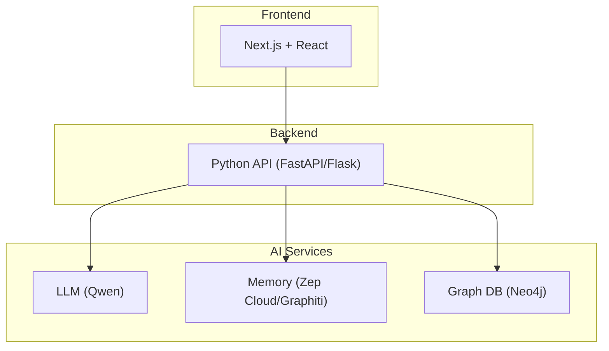
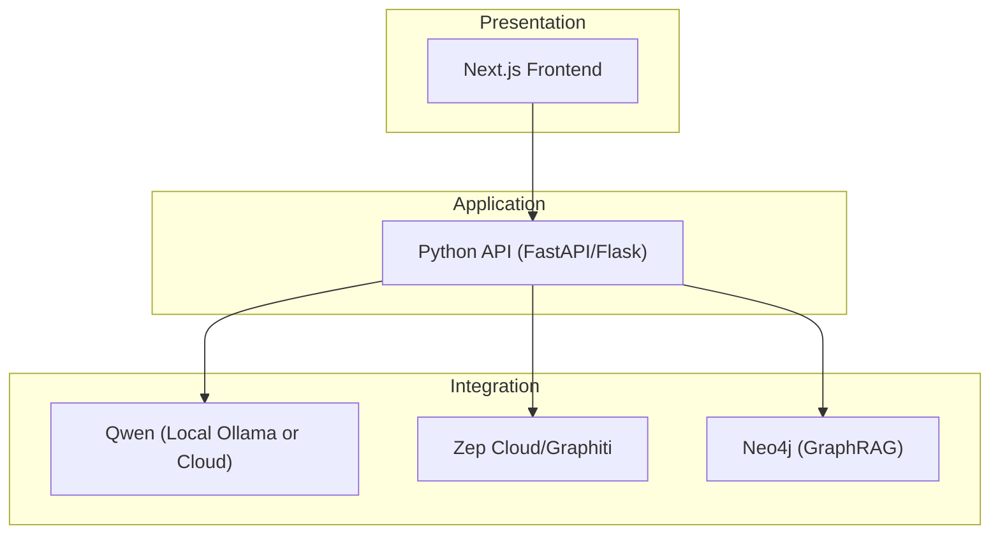
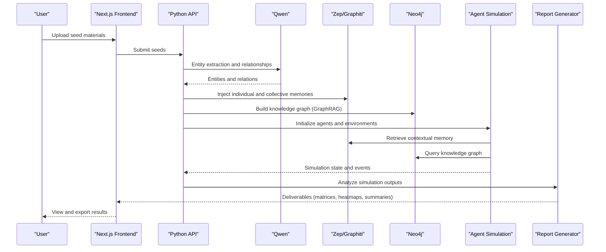
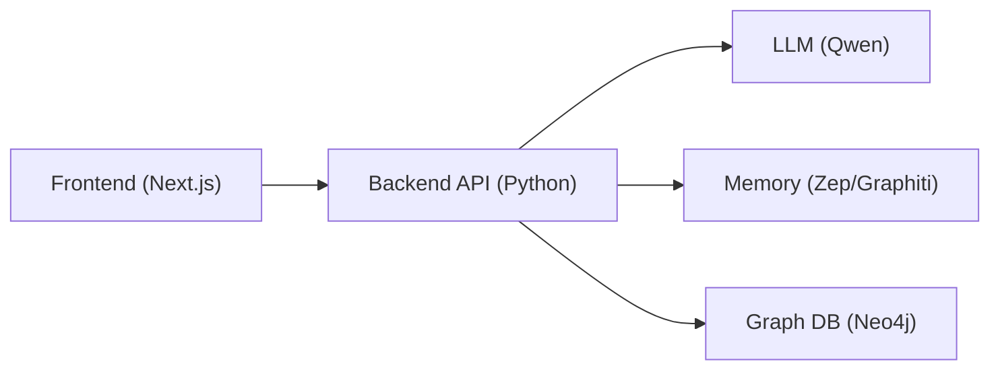

# Technical Architecture

<cite>
**Referenced Files in This Document**
- [PRD.md](file://PRD.md)
- [Enhancing MiroFish for Strategy Consultants.md](file://Research/Enhancing MiroFish for Strategy Consultants.md)
</cite>

## Table of Contents
1. [Introduction](#introduction)
2. [Project Structure](#project-structure)
3. [Core Components](#core-components)
4. [Architecture Overview](#architecture-overview)
5. [Detailed Component Analysis](#detailed-component-analysis)
6. [Dependency Analysis](#dependency-analysis)
7. [Performance Considerations](#performance-considerations)
8. [Troubleshooting Guide](#troubleshooting-guide)
9. [Conclusion](#conclusion)
10. [Appendices](#appendices)

## Introduction
This document describes the technical architecture of MiroFish, an AI-powered strategic simulation and war-gaming platform for strategy consultants. The system integrates a Next.js frontend, a Python backend API, and AI services including an LLM (Qwen), memory services (Zep Cloud/Graphiti), and a graph database (Neo4j). It explains how data flows from seed materials through graph building to multi-agent simulation and report generation, and documents technical decisions such as microservices architecture, event-driven processing, and layered architecture patterns. Infrastructure requirements, scalability considerations, and deployment topology options are included, along with cross-cutting concerns like security, monitoring, and disaster recovery.

## Project Structure
The repository provides a product requirements and architecture document that outlines the system’s high-level design, technology stack, and deployment options. The document defines the frontend, backend, and AI service boundaries, and specifies environment variables and operational requirements.

**Diagram sources**
- [PRD.md:135-159](file://PRD.md#L135-L159)
- [PRD.md:161-173](file://PRD.md#L161-L173)

**Section sources**
- [PRD.md:131-173](file://PRD.md#L131-L173)

## Core Components
- Frontend (Next.js + React): Provides upload, simulation monitor, chat, and report interfaces.
- Backend API (Python/FastAPI/Flask): Orchestrates graph building, agent simulation, and report generation; integrates with LLM, memory, and graph services.
- AI Services:
  - LLM (Qwen): OpenAI-compatible API, local Ollama or cloud via Bailian Platform.
  - Memory (Zep Cloud/Graphiti): Long-term memory for agents; local Neo4j option for air-gapped deployments.
  - Graph DB (Neo4j): Stores knowledge graph for retrieval-augmented generation (GraphRAG).

**Section sources**
- [PRD.md:135-159](file://PRD.md#L135-L159)
- [PRD.md:161-173](file://PRD.md#L161-L173)

## Architecture Overview
MiroFish follows a layered architecture with clear separation of concerns:
- Presentation Layer: Next.js frontend.
- Application Layer: Python backend API.
- Integration Layer: LLM, memory, and graph services.
- Data Layer: Neo4j for knowledge graph storage.

The system supports both cloud and air-gapped deployments. In air-gapped mode, local Ollama and Neo4j replace external services for confidentiality.

**Diagram sources**
- [PRD.md:135-159](file://PRD.md#L135-L159)
- [PRD.md:161-173](file://PRD.md#L161-L173)

## Detailed Component Analysis

### Data Flow: From Seed Materials to Simulation and Reports
The end-to-end flow begins with seed materials uploaded by the user, proceeds through graph building and memory injection, and culminates in multi-agent simulation and report generation.

**Diagram sources**
- [PRD.md:60-112](file://PRD.md#L60-L112)
- [PRD.md:135-159](file://PRD.md#L135-L159)

### Microservices and Event-Driven Processing
- Microservices architecture: The backend is organized around cohesive services (graph builder, agent simulation, report generator) that communicate via internal APIs.
- Event-driven processing: Simulation events (agent actions, environment changes) can trigger downstream tasks such as memory updates and report generation.
- Layered architecture: Clear separation between presentation, application, integration, and data layers.

**Section sources**
- [PRD.md:135-159](file://PRD.md#L135-L159)
- [PRD.md:239-250](file://PRD.md#L239-L250)

### LLM Integration (Qwen)
- OpenAI-compatible API with local Ollama and cloud via Bailian Platform.
- Base URLs for local and cloud modes are configurable via environment variables.

**Section sources**
- [PRD.md:174-182](file://PRD.md#L174-L182)
- [PRD.md:277-290](file://PRD.md#L277-L290)

### Memory Services (Zep Cloud/Graphiti)
- Supports local Neo4j and cloud Zep for long-term agent memory.
- Free tier is sufficient for simple usage; air-gapped deployments prefer local Graphiti + Neo4j.

**Section sources**
- [PRD.md:183-187](file://PRD.md#L183-L187)
- [PRD.md:277-290](file://PRD.md#L277-L290)

### Graph Database (Neo4j)
- Used for constructing and querying a knowledge graph (GraphRAG) to support retrieval-augmented generation.
- Supports air-gapped deployments with local Neo4j.

**Section sources**
- [PRD.md:169-170](file://PRD.md#L169-L170)
- [PRD.md:277-290](file://PRD.md#L277-L290)

### MCP Server Integration
- A FastAPI-based MCP wrapper enables invoking simulations from Claude Desktop, Cursor, and IDE pipelines.
- This enables seamless integration into consultant workflows.

**Section sources**
- [PRD.md:172](file://PRD.md#L172)
- [PRD.md:277-290](file://PRD.md#L277-L290)

### Miro Board Export
- One-click export of simulation outputs to Miro boards using frames, app cards, and sticky notes.
- Supports client-ready deliverables for steering committees.

**Section sources**
- [PRD.md:53](file://PRD.md#L53)
- [PRD.md:208](file://PRD.md#L208)
- [PRD.md:277-290](file://PRD.md#L277-L290)

## Dependency Analysis
The system exhibits a clean dependency structure with the frontend depending on the backend, and the backend integrating with AI services and graph storage.

**Diagram sources**
- [PRD.md:135-159](file://PRD.md#L135-L159)
- [PRD.md:161-173](file://PRD.md#L161-L173)

**Section sources**
- [PRD.md:135-159](file://PRD.md#L135-L159)
- [PRD.md:161-173](file://PRD.md#L161-L173)

## Performance Considerations
- Response targets: page load under 3 seconds, API p95 under 500 ms, simulation initialization under 60 seconds, report generation under 30 seconds.
- Horizontal scaling: containerized deployment with stateless backend design.
- Memory management: efficient handling of large agent populations.

**Section sources**
- [PRD.md:222-230](file://PRD.md#L222-L230)
- [PRD.md:239-244](file://PRD.md#L239-L244)

## Troubleshooting Guide
- API key encryption at rest and rate limiting on endpoints.
- Graceful degradation when LLM API is unavailable with automatic retry and exponential backoff.
- Centralized logging and error tracking/alerting for monitoring.

**Section sources**
- [PRD.md:232-238](file://PRD.md#L232-L238)
- [PRD.md:245-250](file://PRD.md#L245-L250)
- [PRD.md:292-298](file://PRD.md#L292-L298)

## Conclusion
MiroFish’s architecture balances modularity, scalability, and confidentiality. The layered design with microservices and event-driven processing supports robust simulation workflows, while the integration of Qwen, Zep/Graphiti, and Neo4j enables high-fidelity strategic scenario planning. Containerized deployment and air-gapped options address enterprise requirements, and MCP and Miro integrations streamline consultant workflows.

## Appendices

### Deployment Topologies
- Source code deployment for development and local testing.
- Docker deployment for production with environment variables configured.

**Section sources**
- [PRD.md:255-276](file://PRD.md#L255-L276)
- [PRD.md:277-290](file://PRD.md#L277-L290)

### Technology Stack
- Frontend: Next.js + React
- Backend: Python (FastAPI/Flask)
- LLM: OpenAI-compatible (local Ollama or Qwen via Bailian Platform)
- Memory: Graphiti + Neo4j (local) or Zep Cloud
- Graph DB: Neo4j
- Containerization: Docker + Docker Compose
- MCP Server: FastAPI-based wrapper

**Section sources**
- [PRD.md:161-173](file://PRD.md#L161-L173)

### Cross-Cutting Concerns
- Security: API key encryption at rest, input validation, rate limiting, no persistent storage of sensitive data.
- Monitoring: centralized application logs, LLM usage tracking, simulation metrics, error tracking and alerting.
- Disaster Recovery: graceful degradation and retries when LLM is unavailable.

**Section sources**
- [PRD.md:232-238](file://PRD.md#L232-L238)
- [PRD.md:245-250](file://PRD.md#L245-L250)
- [PRD.md:292-298](file://PRD.md#L292-L298)